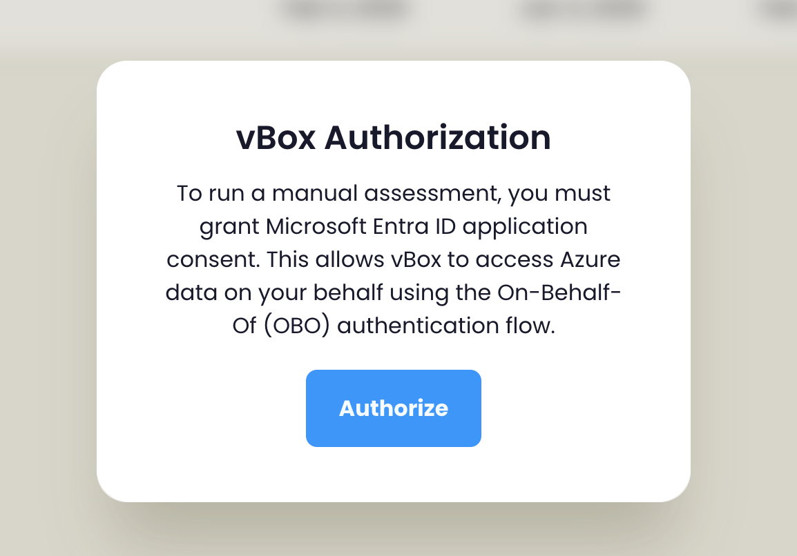

vBox uses a **workspace-based RBAC (Role-Based Access Control)** system where permissions are determined dynamically per workspace or customer organization. This means a user's effective role can vary depending on which resource they are accessing.

## User Roles

vBox defines three primary roles. Roles are derived from permission strings assigned at the workspace or customer level:

| Role | Internal Permission | Description |
|------|---------------------|-------------|
| **Organization Reader** | *(default — no elevated permission)* | Read-only access to assigned organization dashboards and recommendations |
| **Organization Contributor** (MSP) | `Temp.OrganizationContributor` | Full operational access — assessments, customer management, workspace navigation |
| **Organization Owner** (Account Manager) | `Temp.OrganizationOwner` | Customer relationship management — organization settings, user management, reports |

:::note[Dynamic Permissions]
Permissions are fetched per resource (customer or workspace) and cached. When you switch between customers or workspaces, your effective permissions are re-evaluated automatically.
:::

### Organization Reader

Organization Readers have the most restricted access level, designed for end customers who need to view their organization's data.

**Capabilities:**
- View dashboards for assigned organizations
- Access recommendations (Security, Operations, Cost)
- View cost details and historical data
- Create and manage tasks
- View reports and summaries

**Restrictions:**
- Cannot access workspace management
- Cannot modify organization settings
- Cannot manage users
- Cannot create or manage assessments
- Can only access organizations they are explicitly assigned to

### Organization Contributor (MSP)

Organization Contributors are MSP (Managed Service Provider) users with comprehensive access to manage multiple customer organizations.

**Capabilities:**
- All Organization Reader capabilities
- Create and manage assessments (Cost, Security, Operations)
- View and navigate workspaces
- Create and manage customer organizations
- Configure organization settings through the customer wizard
- Access all customer dashboards and reports
- Manage organization users (Readers, Contributors, Owners)
- Configure feature toggles and subscription plans
- Set up notifications and ITSM integration
- Import recommendations and questionnaires
- Edit recommendation properties
- Access Advanced optimizations tab

:::tip[MSP Best Practices]
Organization Contributors should regularly review organization configurations, monitor active tasks, and ensure data collection schedules are appropriate for each customer's needs.
:::

### Organization Owner (Account Manager)

Organization Owners focus on customer relationship management and have elevated access to customer-facing features.

**Capabilities:**
- View customer organizations and profiles
- Manage customer information and settings
- View customer dashboards and reports
- Manage users within customer organizations
- Access customer summaries and recommendations
- Access Advanced optimizations tab

**Restrictions:**
- Cannot access workspace management
- Cannot create or manage assessments
- Cannot modify technical settings (subscriptions, scheduling)

## Inventory Permissions

In addition to role-based access, vBox has granular inventory view permissions that control access to resource-level data:

| Permission | Constant | Controls |
|------------|----------|----------|
| **Cost Inventory View** | `OptimizationInventory.View` | Access to cost recommendation resource inventory and export |
| **Security Inventory View** | `SecurityInventory.View` | Access to security recommendation resource tabs and export |
| **Operations Inventory View** | `OperationsInventory.View` | Access to operations recommendation resource inventory and export |

:::note
Users require the specific permission to be included in their workspace permissions to access inventory views.
:::

## Route Guards and Access Control

vBox implements route guards that enforce access control throughout the application. Guards wait for permissions to load before evaluating access, ensuring accurate authorization.

| Route Guard | Protected Routes | Required Role |
|-------------|------------------|---------------|
| `canActivateMsp` | MSP-specific features (assessments, imports, workspace creation/editing) | Organization Contributor |
| `canActivateCustomerRoute` | Customer organization routes | Contributor or Owner (plus assignment check) |
| `canActivateWorkspaceRoute` | Workspace management routes | User must have access to the specific workspace |
| `canActivateChildFeatureFlag` | Feature-specific routes | User with access + feature flag enabled for the organization |

### How Route Guards Work

**canActivateMsp**
- Allows: Organization Contributors
- Blocks: Organization Readers, Organization Owners (unless the route also permits Owners)
- On denial: Redirects to home with snackbar message

**canActivateCustomerRoute**
- Allows: Contributors, Owners
- Also checks: User assignment to the specific organization
- For Contributors: Checks all accessible customers
- For Readers: Only checks their explicitly assigned `clientsIds`
- On denial: Redirects to home with snackbar message

**canActivateWorkspaceRoute**
- Validates: The `workspaceId` exists in the user's accessible workspaces
- On denial: Redirects to home with snackbar message

**canActivateChildFeatureFlag**
- Checks: Feature flag is enabled for the route's organization
- On denial: Redirects to home

:::note[Access Denied]
When a route guard blocks access, you will see a snackbar notification: **"No permission to view this content. Redirected."** If this happens:
1. Verify your role has the required permissions for that resource
2. Confirm you are assigned to the organization (for customer routes)
3. Check that the feature is enabled for the organization
:::

## Unauthorized Page

If you navigate to a resource you do not have permission to access, vBox displays a dedicated **Unauthorized (403)** page with:

- A clear error message explaining the access denial
- A link to contact support at **help@vboxcloud.com** (pre-filled with your error details)
- A **Log out** button to switch accounts if needed

## OBO Authentication (On-Behalf-Of)

:::note[Organization Contributors Only]
OBO authentication applies only to Organization Contributors (MSP) who run assessments and manage customer environments. Organization Readers do not encounter OBO prompts.
:::

vBox uses Microsoft Entra ID **On-Behalf-Of (OBO)** authentication for actions that require direct access to your Azure resources.

### When OBO Authentication Appears

The OBO authorization modal appears automatically before:

- **Mapping subscriptions** during organization creation or editing
- **Running** a manual assessment
- **Deploying** an assessment environment
- **Starting** an assessment

### Authorization Flow

1. A modal appears titled **"vBox Authorization"** explaining that Microsoft Entra ID consent is required
2. Click the **Authorize** button to open a Microsoft authentication popup
3. Sign in and grant consent in the popup window
4. The popup closes and you are returned to vBox with authorization complete

Autorization popup:

Application Consent popup:

:::tip
OBO authorization tokens are stored for your session. You typically only need to authorize once per browser session.
:::

### Authorization Errors

If authorization fails, a snackbar notification will display an error message. Common causes:

- The Microsoft popup was blocked by your browser — allow popups for the vBox domain
- Your Azure AD account does not have sufficient permissions
- Network connectivity issues during the authentication flow

### Azure Authorization Status

You can check your OBO authorization status in the **Global Settings** dialog (accessible from the application header for Contributors). The Azure Authorization section shows:

- A **checkmark** icon if vBox is authorized to access Azure resources on your behalf
- A **warning** icon if authorization is needed or has expired

## User Management

### Organization-Level User Assignment

Within each customer organization, users are assigned to specific roles through the Customer Configuration Wizard (Step 3):

| Role | Assignment | Description |
|------|------------|-------------|
| **Organization Readers** | Add/remove with Email, First Name, Last Name | Users with read-only access to organization data |
| **Organization Contributors** | Add/remove with Email, First Name, Last Name | MSP users assigned to manage this organization |
| **Organization Owner** | Select from Organization Contributors | Primary account manager for the customer |
| **Scheduled Data Collection User** | Select from Organization Contributors | User account used for scheduled data collection runs |

:::caution[Scheduled Data Collection User]
The Scheduled Data Collection User is required and must be an Organization Contributor. If the selected user is removed from the Contributors list, this field is automatically cleared and must be reassigned.
:::

### User Assignment Best Practices

1. **Principle of Least Privilege** — Assign users only the minimum access level required
2. **Regular Audits** — Periodically review user assignments to ensure they are still appropriate
3. **Clear Responsibilities** — Document which Contributors are responsible for which organizations
4. **Owner Assignment** — Ensure each customer has a designated Organization Owner
5. **Data Collection User** — Verify the Scheduled Data Collection User has appropriate Azure permissions

## Role-Based Feature Access

Feature visibility depends on three factors: user role, feature flags, and organization assignment.

### 1. User Role

| Feature | Organization Reader | Organization Owner | Organization Contributor |
|---------|--------------------|--------------------|--------------------------|
| Dashboards | Assigned orgs only | Assigned orgs only | All orgs |
| Recommendations | Assigned orgs only | Assigned orgs only | All orgs |
| Tasks | Assigned orgs only | Assigned orgs only | All orgs |
| Customer Management | No | Yes | Yes |
| Assessments | No | No | Yes |
| Workspace Management | No | No | Yes |
| Global Settings | No | No | Yes |

### 2. Feature Flags

Features enabled for the customer organization control access to specific areas:

| Feature Flag | Routes Affected | Description |
|--------------|-----------------|-------------|
| **Security** | `/organization/:customerId/security` | Security features and Secure Score |
| **Operations** | `/organization/:customerId/operations` | Operations features and Observability Score |
| **Cost Details** | `/organization/:customerId/cost` | Detailed cost analysis |
| **BI Analytics** | Summary pages | Embedded Metabase dashboards |
| **Tasks** | `/organization/:customerId/tasks` | Task management features |

:::tip[Feature Flag Configuration]
Feature flags are configured in Step 4 of the Customer Configuration Wizard. Enable only the features included in the customer's subscription plan.
:::

### 3. Organization Assignment

Organization Readers can only access organizations to which they are explicitly assigned. Organization Contributors have access to all organizations within their accessible workspaces.

## Global Settings

Organization Contributors can access the **Global Settings** dialog from the application header. It includes:

### Azure Authorization
- Displays the current OBO authorization status (authorized or needs authorization)
- See [OBO Authentication](#obo-authentication-on-behalf-of) above for details

### Workspaces and Organizations Visibility
- **Tree-based selector** for choosing which workspaces and organizations appear in your navigation
- **Search** field with clear button to filter the tree
- **Toggle Collapse** button to expand/collapse all nodes
- **Select All** option at the top of the tree
- At least one workspace or organization must be selected

:::note[Global Settings Access]
The Global Settings dialog is available to Organization Contributors only.
:::

## Security Considerations

1. **Role Assignment** — Regularly audit user role assignments to ensure they match current responsibilities
2. **Organization Access** — Verify that users only have access to organizations they should manage
3. **Feature Flags** — Ensure feature flags match subscription plans to prevent unauthorized access
4. **Scheduled Data Collection User** — Ensure the data collection user has appropriate Azure permissions and is kept up to date
5. **OBO Authorization** — Review OBO authorization status periodically in Global Settings

:::caution[Security Best Practices]
- Never share user credentials
- Regularly review and remove inactive user accounts
- Use strong authentication methods
- Monitor access logs for unusual activity
:::

## Troubleshooting Access Issues

If you are experiencing access issues:

1. **Verify Role** — Confirm your user role has the required permissions for the resource you are trying to access
2. **Check Assignment** — Ensure you are assigned to the organization (for Organization Readers)
3. **Feature Flags** — Verify the feature is enabled for the organization
4. **OBO Authorization** — If running assessments, check that OBO authorization is complete in Global Settings
5. **Unauthorized Page** — If you see the 403 page, use the support email link to request access
6. **Contact Administrator** — Reach out to your vBox administrator if issues persist

:::note
Contact your vBox administrator if you need access to features that are not visible in your navigation menu.
:::
