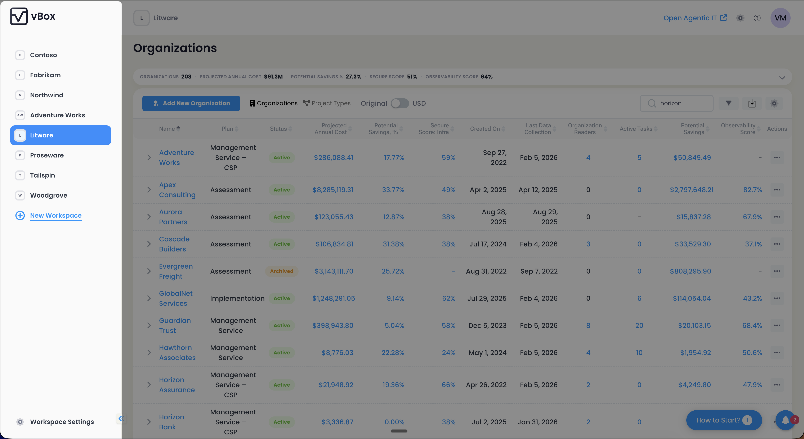
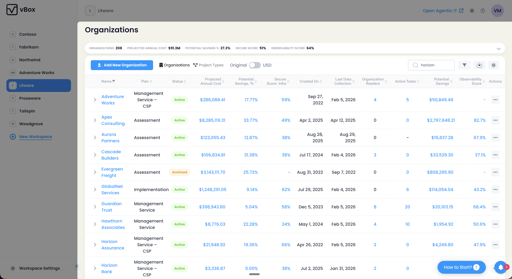

:::note[Contributor Feature]
Workspace management is available only for Organization Contributors (MSP).
:::

Workspaces in vBox allow Organization Contributors to organize and manage multiple customer environments from a single pane of glass. Workspaces provide logical grouping of customer organizations and help streamline administration across different business units or service tiers.

## Access Control

Workspace management routes are protected by role-based access control:

| Route | Access Level | Description |
|-------|-------------|-------------|
| `/workspaces` | Organization Contributor | View all workspaces |
| `/workspaces/add` | Organization Contributor | Create new workspace |
| `/workspaces/:id` | Organization Contributor | View workspace details |
| `/workspaces/:id/edit` | Organization Contributor | Edit workspace settings |
| `/workspaces/:id/organizations` | Organization Contributor | Manage organizations within workspace |

:::caution[Permission Required]
Only Organization Contributors can create, edit, and manage workspaces.
:::

## Workspace Navigation

Workspaces are displayed in the sidebar menu, allowing quick navigation between different workspace contexts. The active workspace is highlighted, and you can switch workspaces directly from the navigation panel.

## Creating a Workspace

Organization Contributors can create new workspaces through the `/workspaces/add` route. The workspace creation form includes:

### Required Fields

| Field | Requirements | Description |
|-------|-------------|-------------|
| **Name** | Required, 5-255 characters | Unique workspace identifier displayed in the sidebar and throughout the application |

### Optional Fields

| Field | Description |
|-------|-------------|
| **Description** | Additional context about the workspace purpose, customer grouping, or organizational structure |

:::tip[Workspace Naming]
Use descriptive names that clearly indicate the workspace purpose, such as "Enterprise Customers" or "SMB Tier 1". This helps MSP users quickly identify the correct workspace context.
:::

## Editing Workspaces

Organization Contributors can modify workspace settings through the `/workspaces/:id/edit` route. The edit form uses the same fields as the creation form, allowing you to update the workspace name and description.

:::note
Workspace edits affect all users with access to that workspace. Changes are reflected immediately in the sidebar navigation.
:::

## Managing Organizations

Each workspace can contain multiple customer organizations. Navigate to `/workspaces/:id/organizations` to view and manage all organizations within a specific workspace.

## Global Settings

Organization Contributors can access the Global Settings dialog from the application header. It includes two sections:

### Azure Authorization

Displays the current OBO (On-Behalf-Of) authorization status — a checkmark if authorized, or a warning icon if authorization is needed. See [OBO Authentication](/administration/users-and-roles/#obo-authentication-on-behalf-of) for details.

### Workspaces and Organizations Visibility

A tree-based selection interface that allows you to:

- Control which workspaces are visible in your navigation
- Filter organizations within workspaces using the **Search** field
- Use **Toggle Collapse** to expand or collapse all tree nodes
- Use **Select All** to quickly toggle all items
- At least one workspace or organization must remain selected

:::tip[Customized Views]
Use Global Settings to create a personalized administrative view that focuses on the workspaces and organizations you manage most frequently.
:::

## Workspace Best Practices

1. **Logical Grouping** — Organize workspaces by customer tier, geographic region, or service level
2. **Clear Naming** — Use descriptive names that indicate workspace purpose
3. **Documentation** — Use the description field to document workspace purpose and any special considerations
4. **Access Management** — Ensure only authorized Organization Contributors have access to sensitive workspaces
