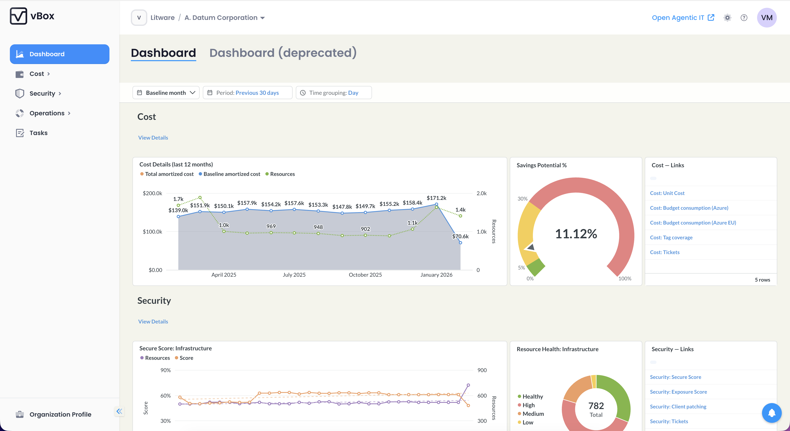
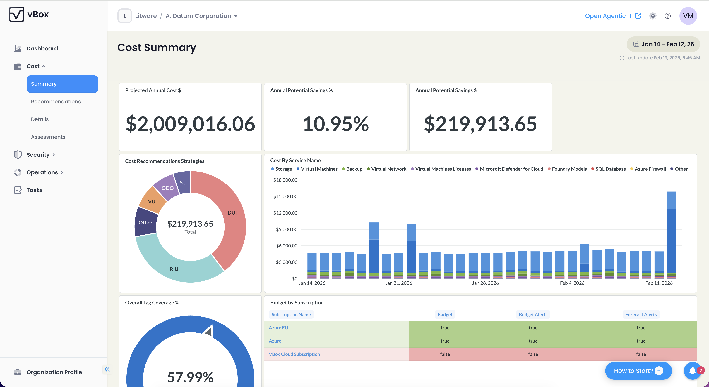
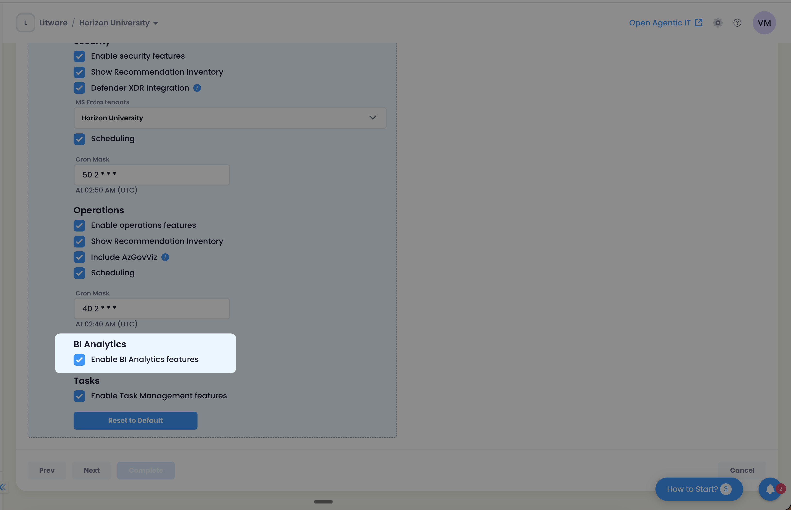

## What is BI Reporting?

Business intelligence (BI) reporting is the process of collecting, analyzing, and presenting business data to provide insights that support decision-making. It involves transforming raw data into meaningful visualizations like charts, dashboards, and reports, making it easier for users to understand trends, patterns, and key performance indicators.

## BI Analytics in vBox

vBox BI Analytics is based on [Metabase](https://www.metabase.com/), an open-source business intelligence tool that allows users to explore, visualize, and share data without needing extensive technical expertise.

Metabase connects to various data sources, allowing users to create dashboards, build visualizations, and embed these into other applications. See the [Metabase documentation](https://www.metabase.com/docs/latest/) for more details.

:::note
All analytics in vBox are Metabase-embedded dashboards. There are no standalone analytics pages—all BI functionality is delivered through embedded Metabase iframes.
:::

## Dashboard Types

vBox provides four types of Metabase-embedded dashboards, each accessible at different routes and serving specific analytical purposes:

| Dashboard Type | Route | Dashboard Type ID | Additional Requirements |
|----------------|-------|-------------------|------------------------|
| **Main Dashboard** | `/dashboard` | `main` | None |
| **Cost Summary** | `/cost/summary` | `costsummary` | None |
| **Security Summary** | `/security/summary` | `securitysummary` | `BI_ANALYTICS` + `SECURITY` features |
| **Operations Summary** | `/operations/summary` | `OperationsSummary` | `BI_ANALYTICS` + `OPERATIONS` features |

:::tip
The Security Summary and Operations Summary dashboards require both the BI Analytics feature flag and their respective feature flags (Security or Operations) to be enabled.
:::

## Implementation Details

### Architecture

All BI dashboards use a shared component (`MetabaseBiDashboardComponent`) that embeds Metabase dashboards via iframe. The component:

- Fetches dashboard metadata from the API endpoint
- Renders the dashboard in an embedded iframe
- Handles authentication and access control

### API Endpoint

Dashboards are retrieved via the following API endpoint:

```
GET /api/v1/customers/{customerId}/biAnalytics/dashboards/regular/{dashboardType}
```

**Response Format:**
```json
{
  "id": "dashboard-id",
  "name": "Dashboard Name",
  "link": "https://metabase-url/embed/dashboard/..."
}
```

The `dashboardType` parameter corresponds to the dashboard type IDs listed in the table above (`main`, `costsummary`, `securitysummary`, `OperationsSummary`).

## Dashboard Details

### Main Dashboard

**Route:** `/dashboard`  
**Dashboard Type:** `main`



The Main Dashboard provides an overview of key metrics and analytics for your infrastructure.

**Charts:**
- Cost Details
- Savings Potential %
- Secure Score: Infrastructure
- Resource Health: Infrastructure
- Backup Jobs %
- Monitoring Coverage %
- Active Recommendations

### Cost Summary Dashboard

**Route:** `/cost/summary`  
**Dashboard Type:** `costsummary`



The Cost Summary Dashboard focuses on cost analysis, optimization opportunities, and budget tracking.

**Charts:**
- Projected Annual Cost $
- Annual Potential Saving %
- Annual Potential Saving $
- Cost Recommendations Strategies
- Cost By Service Name
- Overall Tag Coverage
- Budget by Subscription

### Security Summary Dashboard

**Route:** `/security/summary`  
**Dashboard Type:** `securitysummary`


:::note
Requires both `BI_ANALYTICS` and `SECURITY` feature flags to be enabled.
:::

The Security Summary Dashboard provides comprehensive security metrics and compliance insights.

**Charts:**
- Secure Score
- Secure Score: Infrastructure
- Security Benchmark
- Secure Score: Infrastructure Controls
- Resource Health: Infrastructure

### Operations Summary Dashboard

**Route:** `/operations/summary`  
**Dashboard Type:** `OperationsSummary`


:::note
Requires both `BI_ANALYTICS` and `OPERATIONS` feature flags to be enabled. This dashboard only supports Metabase view (no deprecated widget view available).
:::

The Operations Summary Dashboard tracks operational metrics and observability scores.

**Charts:**
- Observability Score KPI with diff
- Observability Score trend chart
- Potential Observability Score Increase
- Backup jobs completion %
- Active recommendations

## Access Control

### Feature Flag

BI Analytics functionality is controlled by the `BI_ANALYTICS` feature flag (`CustomerComponent.BI_ANALYTICS`).

### Subscription Plans

The BI Analytics feature is **enabled by default** for all subscription plans:
- Assessment
- Implementation
- Management Service CSP
- Management Service

### Backend Access Control

Access to BI Analytics endpoints is enforced at the backend level through the `ComponentAccess` attribute on `BiAnalyticsController`, ensuring that only customers with the appropriate feature flags can access dashboard data.

## Deprecated Views

:::tip
Each summary page (except Operations Summary) includes tabs that allow you to switch between the new Metabase view and the deprecated widget-based views.
:::

The following deprecated widget-based views are still available but will be phased out:

- **Dashboard Component** (`DashboardComponent`) - Deprecated widget view for Main Dashboard
- **Cost Summary Component** (`CostSummaryComponent`) - Deprecated widget view for Cost Summary
- **Security Summary Component** (`SecuritySummaryComponent`) - Deprecated widget view for Security Summary

:::note
The Operations Summary dashboard only supports the Metabase embed view—no deprecated widget view is available for this dashboard.
:::

## How to Enable BI Analytics

To enable the BI Analytics feature, turn on the corresponding setting for a Customer in the Subscription Plan selection panel.



:::tip
BI Analytics is enabled by default for all subscription plans. You typically only need to configure this setting if you want to disable the feature for a specific customer.
:::
