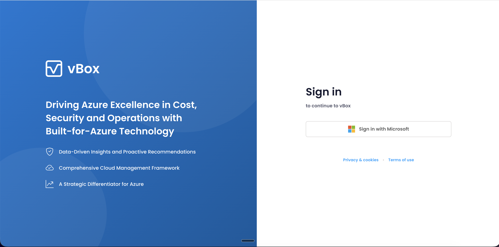
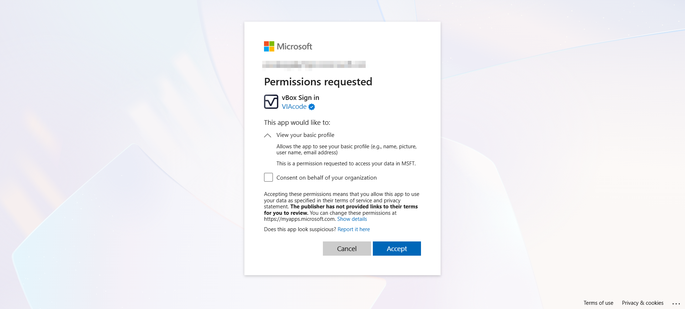

We are rolling out an update to the vBox sign-in experience in the coming days. This update enhances our least-privilege design by aligning the permissions each user is asked to grant with the role they actually perform. It also introduces a redesigned sign-in page.

:::tip[No disruption to your workflow]
Your existing configurations, assessments, and data collection settings are not affected. You will simply sign in as usual and may see a one-time consent prompt — that's it.
:::

## What Is Changing

### New Sign-In Page

You will notice a refreshed sign-in screen when you next log in to vBox. You can continue to sign in using your Microsoft account as before — no new credentials or accounts are needed.

### Simplified Consent

Previously, the first-time sign-in consent was the same for everyone and included Azure infrastructure access — even for users whose roles only required dashboards and reports. With this update, we are aligning the sign-in consent with what each role actually needs.

Now, the first-time consent only requests your **basic account information** (name, email, and organization). That is it — no Azure infrastructure access is included at sign-in.

#### Before vs. After

| | Before | After |
|---|--------|-------|
| **Consent scope** | Same broad consent for all users, regardless of role | Permissions aligned with each user's role |
| **Azure access** | Granted to every user at sign-in, even if not needed | Granted only to Contributors when they perform Azure operations |
| **First sign-in** | Broad consent including Azure infrastructure read access | Lightweight consent for basic profile information only |

### Additional Consent Only When Needed

Users who need to set up data collection, map Azure subscriptions, or run assessments (**Organization Contributors**) will be prompted to accept an additional consent at the point they perform that action. This additional consent grants the Azure environment access that is required for those specific operations. If your role does not involve these tasks, you will never see this prompt.

:::tip[Organization Contributors]
If you run assessments or configure customer environments, you will see an additional authorization prompt the first time you perform one of those actions after the update. This is the On-Behalf-Of (OBO) authorization flow — see [OBO Authentication](/administration/users-and-roles/#obo-authentication-on-behalf-of) for details.
:::

## What You Need to Do

For most users, nothing changes in your day-to-day workflow. When you next sign in after the update:

1. **See the new sign-in page** — click **Sign in with Microsoft** as usual
2. **Accept the new consent** — you may be asked to accept a new, lightweight consent for basic profile access. Click **Accept**
3. **Continue using vBox** — everything else works exactly as before

## Why We Made This Change

This update implements a **least-privilege design** — a security best practice where each user is only asked for the permissions their role actually requires. By separating the sign-in consent from the optional Azure access consent, we ensure that permissions are always aligned with what you do in vBox. No existing configurations or data collection settings are affected.

## Questions?

If you have any questions about this update, reach out to us at [help@vboxcloud.com](mailto:help@vboxcloud.com).
