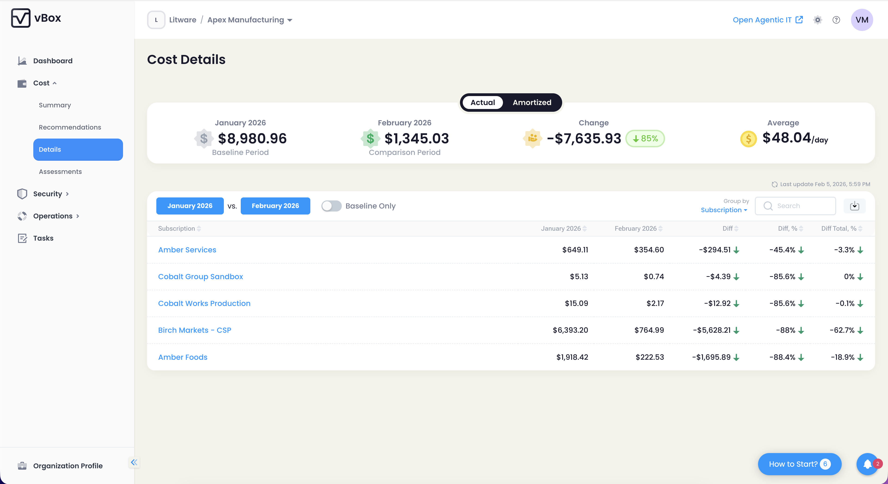
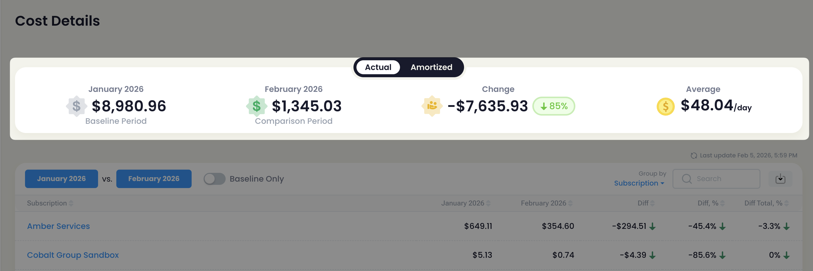
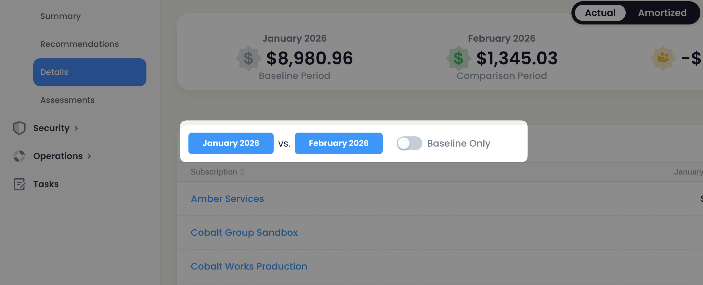
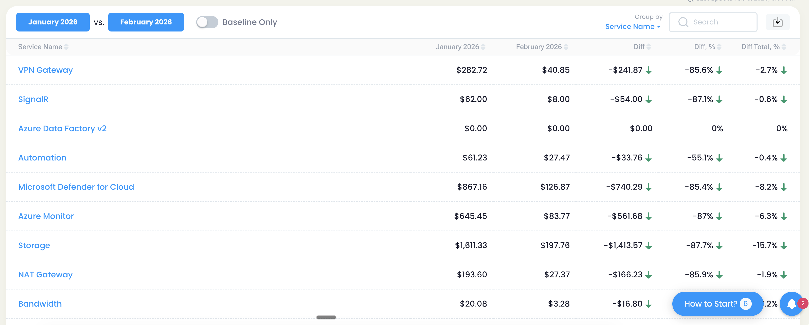
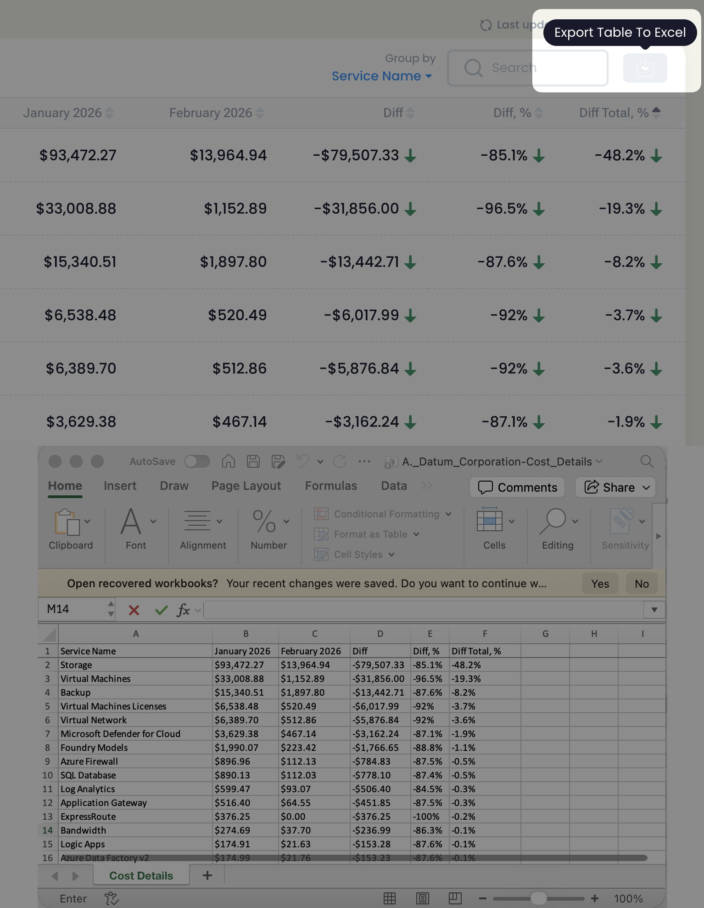
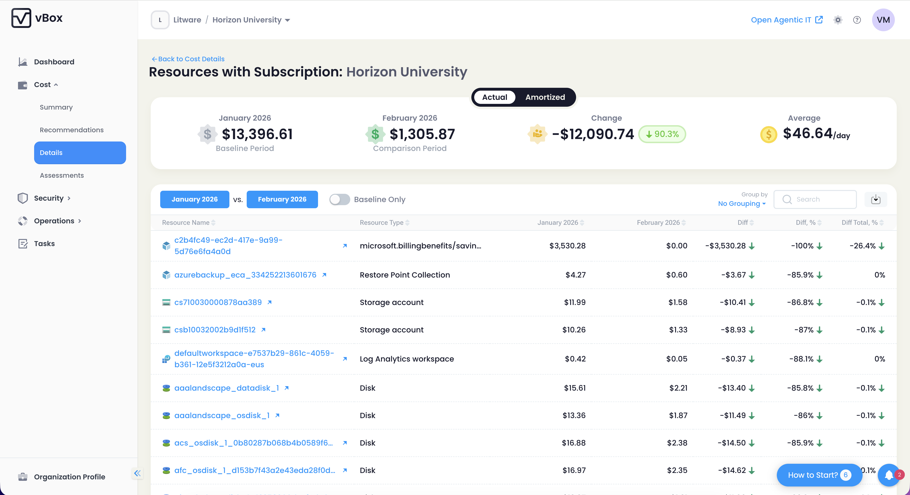
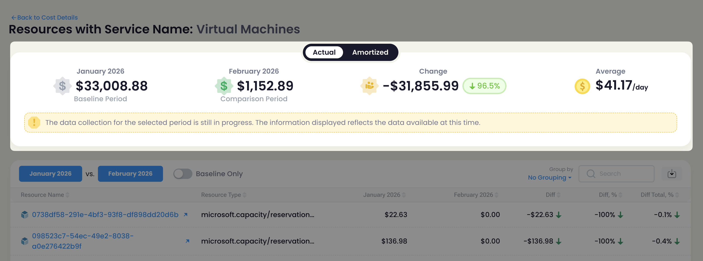
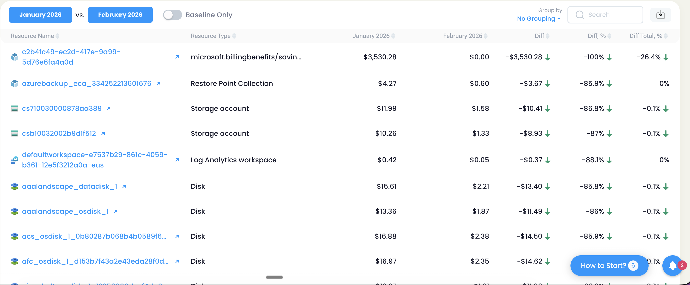
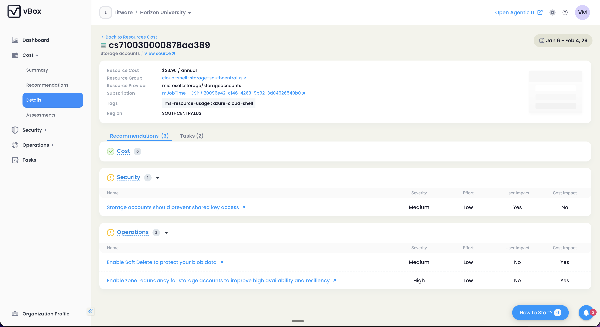

The **Cost Details** feature allows users to analyze Azure infrastructure costs with last-year data. It includes advanced grouping, filtering, and baseline comparison to optimize spending and track trends effectively.

This feature includes two pages:

- **Cost Details** — High-level cost analysis grouped by subscription, service, region, etc.
- **Group Details** — Resource-level cost breakdown within a selected group, with drill-down to Resource Profile

:::note
Once this feature is enabled, vBox ingests cost data for the last 12 months from Azure and continues incremental daily collection to provide historical data beyond the last year.
:::

## Cost Details Page

The Cost Details page provides comprehensive cost analysis with baseline comparison, advanced grouping options, and detailed cost breakdowns.

### Cost KPI Panel

The panel at the top of the page displays key performance indicators related to Azure spend for your infrastructure:

| KPI | Description |
|-----|-------------|
| **Baseline Period Cost** | Total cost amount of the infrastructure within the selected baseline period |
| **Comparison Period Cost** | Total cost amount of the infrastructure within the selected comparison period |
| **Change** | The amount showing how total cost changed from baseline to comparison periods, displayed as both absolute value and percentage |
| **Average Cost/Day** | The average total infrastructure cost per day within the comparison period |

### Date Controls and Cost Type Toggle

The page includes comprehensive date selection controls:

- **Baseline Period Picker** — Select the baseline month for comparison
- **Comparison Period Picker** — Select the comparison month to analyze
- **Baseline Only Toggle** — When enabled, shows how the cost of resources that existed in the Baseline Period changed in the Comparison Period

:::tip
Use the "Baseline Only" mode to track cost changes for existing resources, excluding new resources added during the comparison period.
:::

**Cost Type Toggle:**

- **Actual Cost** — Shows the actual cost as billed by Azure
- **Amortized Cost** — Includes reservation costs split proportionally across months, providing a more accurate view of resource utilization

:::note
Switching between Actual and Amortized cost updates all data on the page, including the KPI panel and grid.
:::

### Cost Data Grid

The main data grid displays Azure costs grouped by your selected dimension. The grid includes the following columns:

| Column | Description |
|--------|-------------|
| **Name** | The name of the group (subscription, service, region, etc.) |
| **Baseline Month Cost** | Total cost for this group in the baseline period |
| **Selected Month Cost** | Total cost for this group in the comparison period |
| **Diff** | Absolute difference between comparison and baseline costs |
| **Diff%** | Percentage change relative to baseline cost |
| **Diff Total%** | Percentage of total cost change represented by this group |

**Group By Options:**

The default grouping is **Subscription**. You can change the grouping to analyze costs from different perspectives:

- **Subscription** (default)
- **Service Name**
- **Region**
- **Resource Group**
- **Resource Type**
- **Tags**

:::tip
Group by Tags to analyze costs by custom organizational dimensions like department, project, or environment.
:::

### Data Collection Status

When data collection is in progress, the page automatically refreshes every 3 minutes to display the latest cost data.

:::caution
A warning banner appears when data collection is incomplete, indicating that some cost data may not be available or up to date.
:::

### Export Functionality

You can export the cost details data to Excel for further analysis:

- Click the **Export** button to download the current view
- The exported file is named `Cost_Details.xlsx`
- The export includes all visible columns and filtered data

### Drill-Down Navigation

Clicking on any row in the grid navigates to the **Group Details** page, which provides a resource-level breakdown for the selected group.

---

## Group Details Page

The Group Details page displays cost analysis at the resource level for the group selected on the Cost Details page. This page provides the same powerful analysis tools as the main Cost Details page, but focused on individual resources within the selected group.

### Cost KPI Panel

The KPI panel shows the same metrics as the Cost Details page, but scoped to the selected group:

| KPI | Description |
|-----|-------------|
| **Baseline Period Cost** | Cost amount of the selected group within the selected baseline period |
| **Comparison Period Cost** | Cost amount of the selected group within the selected comparison period |
| **Change** | The amount showing how the cost of the selected group changed from baseline to comparison periods |
| **Average Cost/Day** | The average cost per day within the comparison period for this group |

### Resource-Level Cost Grid

The resource grid displays individual resources and their costs, with the same grouping options available:

- **Subscription**
- **Resource Group**
- **Resource Type**
- **Region**
- **Tags**
- **No Grouping**

The grid columns match the Cost Details page:

- Name
- Baseline Month Cost
- Selected Month Cost
- Diff
- Diff%
- Diff Total%

### Resource Profile Drill-Down

From the Group Details page, you can drill down further to view the **Resource Profile** for any individual resource. This provides comprehensive details about the resource's cost history, configuration, and optimization opportunities.

### Date Controls and Cost Type

The Group Details page includes the same date controls and cost type toggle as the Cost Details page:

- Baseline Period and Comparison Period pickers
- Baseline Only toggle
- Actual Cost vs Amortized Cost toggle

All controls update the KPI panel and grid data accordingly.
