The **Cost Recommendations** page surfaces Azure cost optimization opportunities, highlighting and prioritizing savings recommendations to bring clarity to cloud spend. This page provides comprehensive tools to analyze, manage, and act on cost optimization opportunities.

:::note
The Cost Recommendations feature requires the [COST_DETAILS](/cost-management/details/) feature to be enabled.
:::

## Page Overview

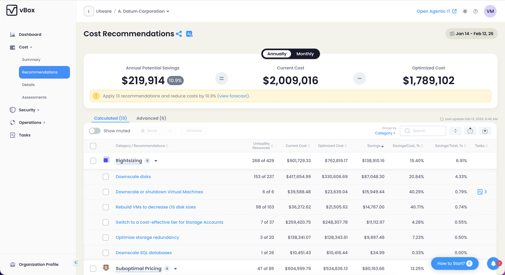

The Cost Recommendations page displays optimization opportunities with detailed savings calculations, resource-level insights, and actionable tasks.

### Tabs 

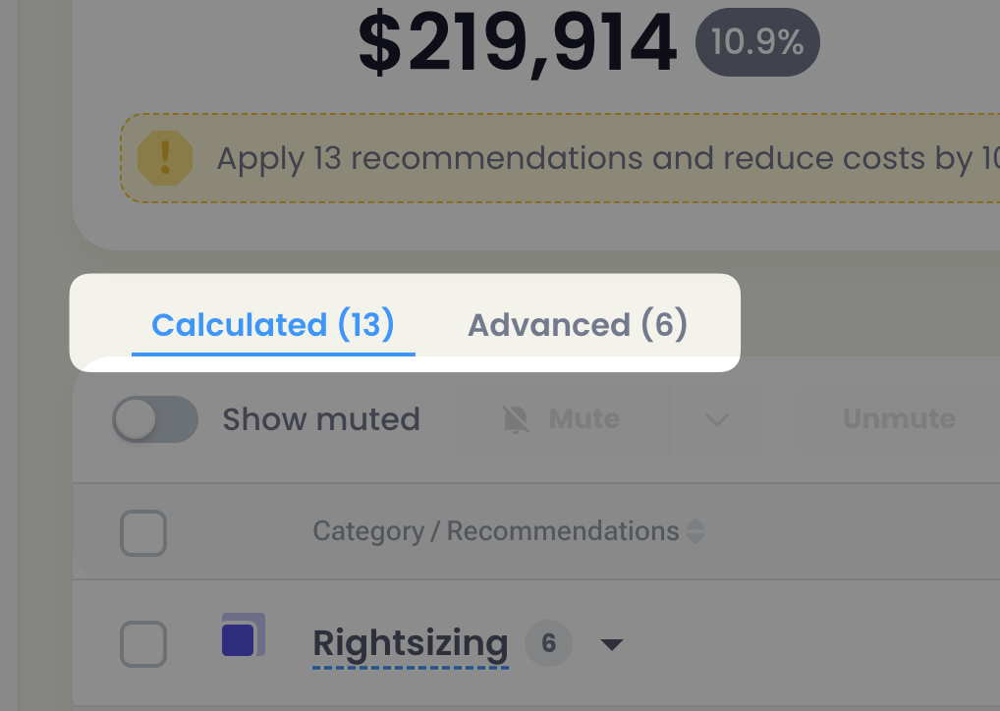

The page includes two tabs:

- **Calculated** — Recommendations generated automatically by vBox's cost analysis engine. Available to all users.
- **Advanced** — Additional recommendations and optimization strategies.

:::note[Contributor Feature]
The **Advanced** tab is available only for Organization Contributors (MSP). Organization Readers see only the Calculated tab.
:::

## Cost Savings Summary Widget

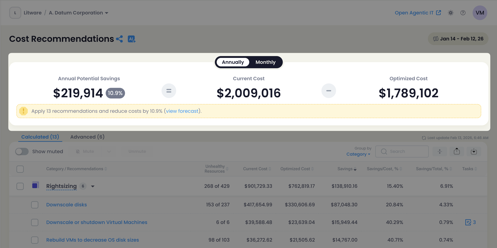

The summary widget at the top of the page provides a high-level overview of potential savings:

| Metric | Description |
|--------|-------------|
| **Total Savings** | Combined potential savings from all recommendations |
| **Non-Optimized Spent** | Current cost of resources that could be optimized |
| **Optimized Spent** | Projected cost after applying recommendations |
| **Recommendation Count** | Total number of optimization opportunities |
| **Cost Reduction %** | Percentage reduction in costs if all recommendations are applied |

**Toggle Options:**

- **Monthly/Annually** — Switch between monthly and annualized savings projections
- **View Forecast** — Link to detailed savings forecast analysis

:::tip
Use the Monthly/Annually toggle to understand both short-term and long-term savings potential.
:::

### AI Summary (Optional)

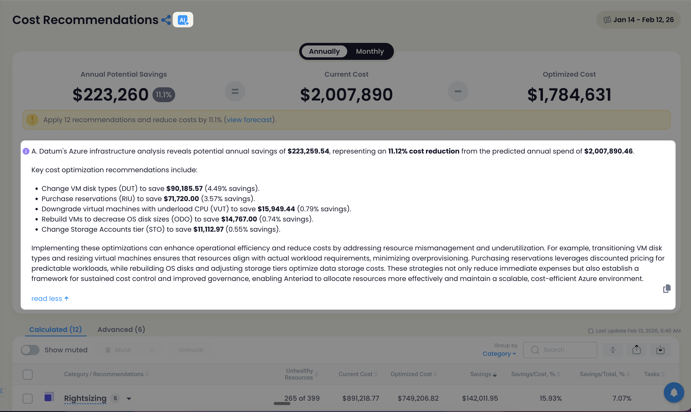

If AI features are enabled ([FEATURE_AI](/analytics/ai-features/) and [FEATURE_AI_COST_SUMMARY](/analytics/ai-features/)), an **AI Summary** button appears that generates an intelligent summary of your cost optimization opportunities.

:::note
AI Summary requires both `FEATURE_AI` and `FEATURE_AI_COST_SUMMARY` feature flags to be enabled.
:::

## Recommendations Grid

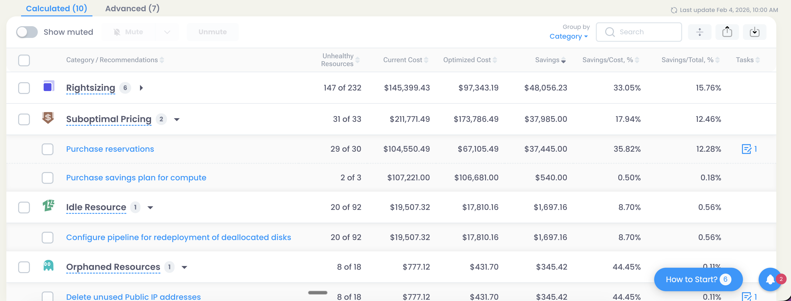

The main grid displays all cost optimization recommendations with comprehensive details:

| Column | Description |
|--------|-------------|
| **Icon** | Visual indicator of recommendation category or type |
| **Category/Recommendations** | The optimization category and recommendation name |
| **Unhealthy Resources** | Count of resources affected (e.g., "5 of 10") |
| **Current Cost** | Current monthly cost of resources in this recommendation |
| **Optimized Cost** | Projected monthly cost after optimization |
| **Savings** | Absolute savings amount |
| **Savings/Cost%** | Savings as percentage of current cost |
| **Savings/Total%** | Savings as percentage of total potential savings |
| **Tasks** | Number of tasks created for this recommendation |

**Default Sort:** Recommendations are sorted by **Savings** in descending order by default, showing the highest-impact opportunities first.

### Group By Options

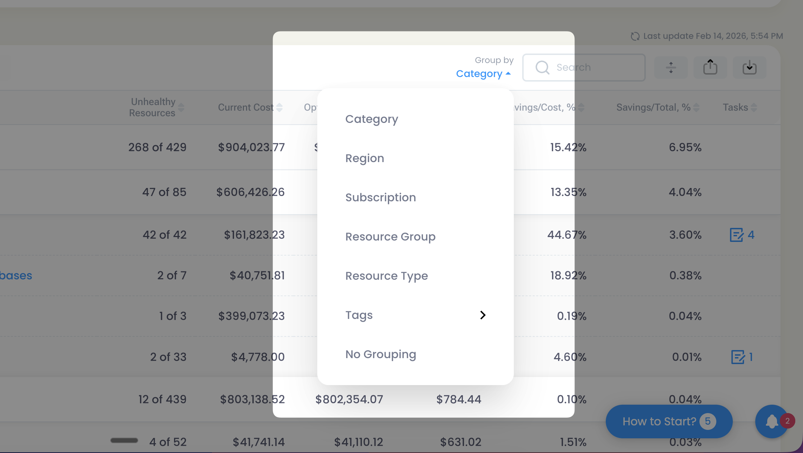

You can group recommendations by different dimensions to analyze patterns:

- **Category** (default)
- **Region**
- **Subscription**
- **Resource Group**
- **Resource Type**
- **Tags**
- **No Grouping**

### Actions and Filters

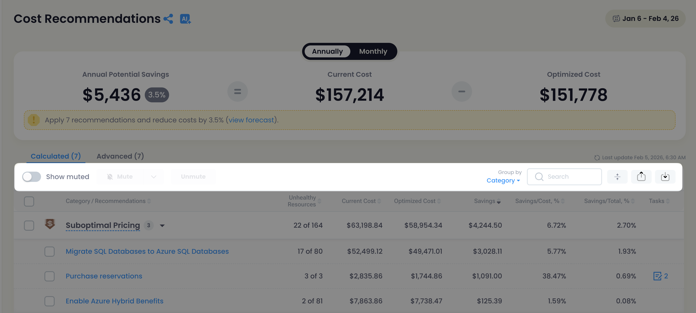

The page includes comprehensive action and filtering capabilities:

**View Controls:**

- **Show Muted Toggle** — Show or hide recommendations that have been muted
- **Search** — Filter recommendations by name, category, or other attributes

**Recommendation Actions:**

- **Mute/Unmute** — Temporarily hide recommendations from view
- **Export** — Export recommendations to Excel or as Optimization Results format
- **Import** — Import optimization results (requires `CAN_IMPORT_OPTIMIZATIONS` feature flag)
- **Share Report** — Send recommendation report via email
- **Download Report** — Download a formatted report document

:::tip
Use the Mute feature to focus on active recommendations while keeping muted ones available for future reference.
:::

## Recommendation Details Page

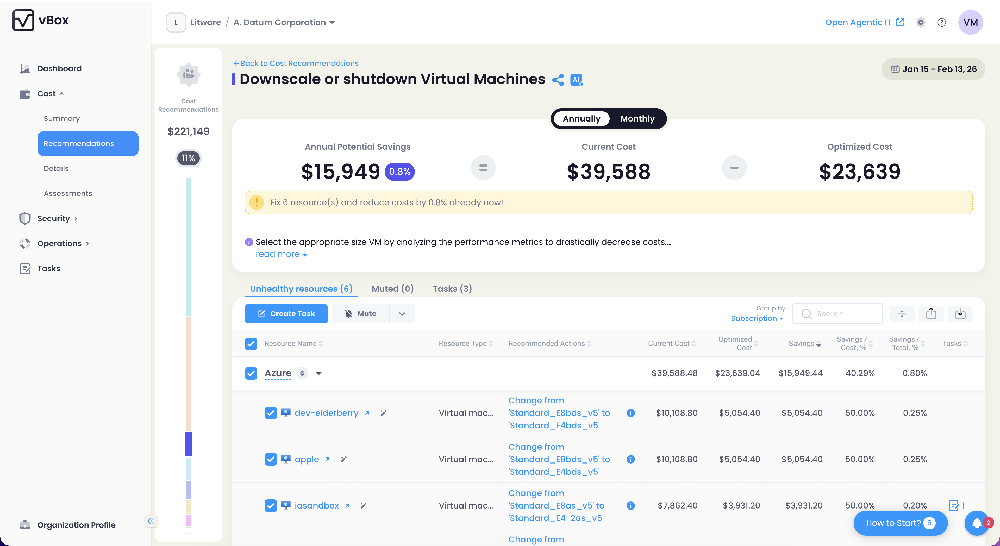

Clicking on a recommendation opens the detailed view, which includes:

### Formula Widget

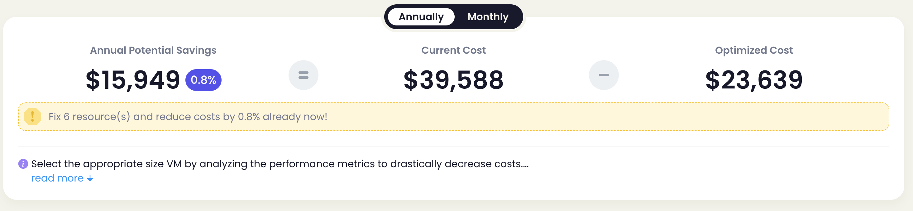

Displays the calculation methodology for the savings estimate, showing how the recommendation's potential savings were calculated.

### Description and Strategy

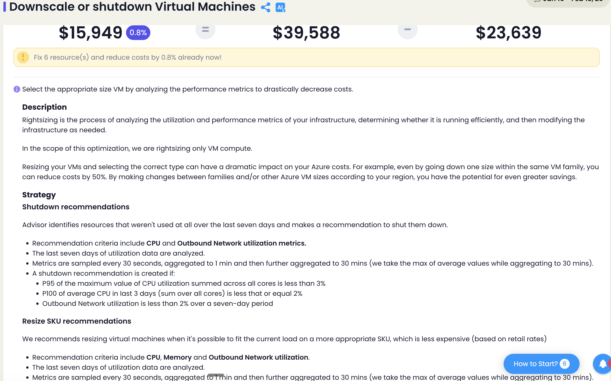

Collapsable panel displays some additional helpfull information about recommendation's implementation 

- **Description** — Detailed explanation of the optimization opportunity
- **Strategy** — Recommended approach to achieve the savings

### Resource Tabs

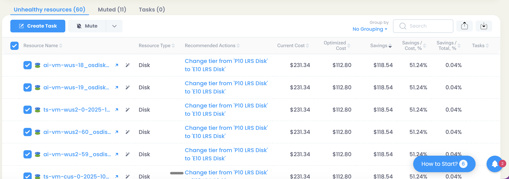

The details page organizes affected resources into tabs:

- **Unhealthy** — Resources that need optimization
- **Muted** — Resources that have been muted from this recommendation
- **Tasks** — Tasks created for implementing this recommendation

### Actions

- **Create Task** — Generate a task for implementing the recommendation (requires `TASKS` feature flag)
- **Change Strategy** — Modify the optimization strategy for this recommendation

:::caution
Creating tasks requires the TASKS feature flag to be enabled. Tasks help track implementation progress and ensure recommendations are acted upon.
:::

## Best Practices

1. **Start with High-Impact** — Focus on recommendations with the highest savings first
2. **Review Resource Details** — Drill into individual recommendations to understand affected resources
3. **Create Tasks** — Use the task creation feature to track implementation progress
4. **Group by Dimension** — Use grouping options to identify patterns across subscriptions, regions, or resource types
5. **Export for Analysis** — Export recommendations for deeper analysis or reporting to stakeholders
6. **Monitor Muted Items** — Periodically review muted recommendations to see if they become relevant

:::tip
Combine grouping by Category with sorting by Savings to quickly identify which types of optimizations offer the best return on investment.
:::
