This guide walks you through the complete first-time setup process, from signing in to running your first assessments. By the end of this guide, you will have:

- Signed in to vBox using your Microsoft account
- Created a **Workspace** to organize your cloud resources
- Set up an **Organization** with Azure subscriptions linked to vBox
- Run all three assessment types: **Cost**, **Security**, and **Operations**

---

## 1. Sign In to vBox

Open your web browser and navigate to the vBox portal URL provided by your administrator.

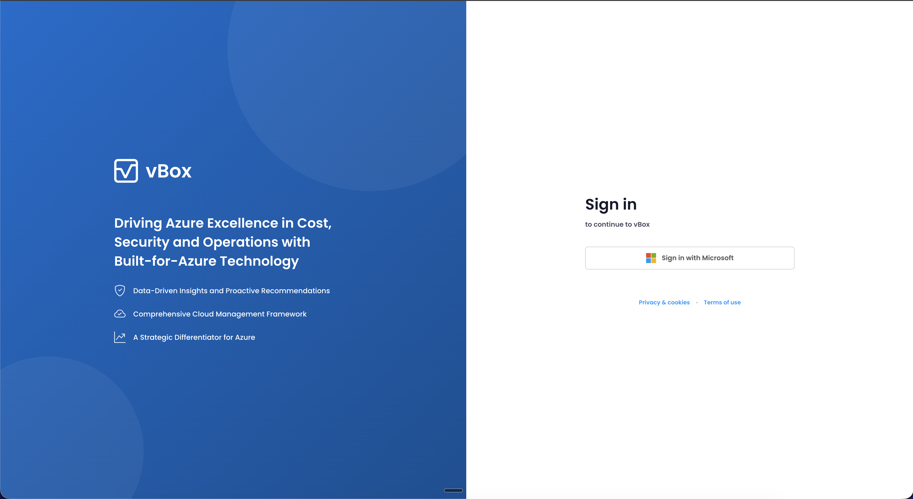

1. Click **Sign in with Microsoft**
2. On the Microsoft "Sign In" page, select your organizational account. If your account is not listed, click **Use another account** to enter your credentials manually.

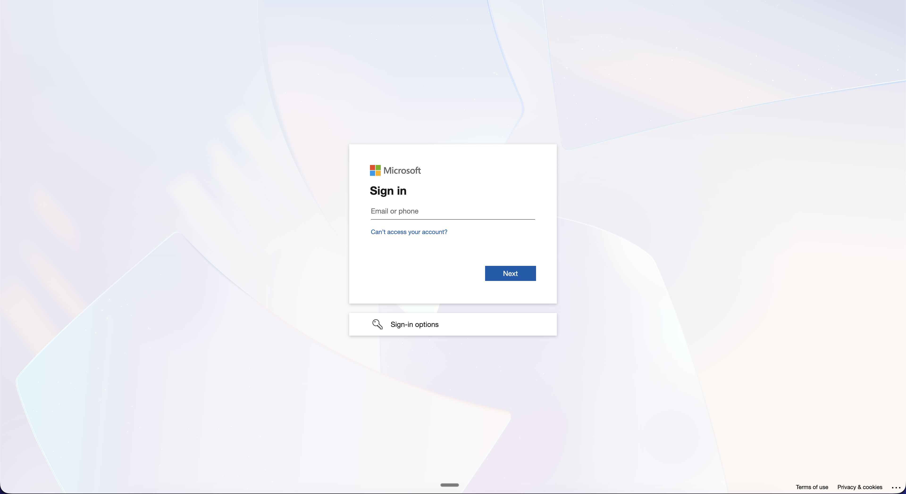

3. Review the **Permissions requested** page. The "vBox Sign in" application will request permission to view your basic profile (name, picture, username, and email address). Click **Accept** to proceed.

:::note
This is a one-time consent for basic profile access. You will not be asked again on subsequent sign-ins unless permissions change.
:::

After accepting permissions, you will be redirected to the vBox portal. Since this is your first time, vBox will guide you through creating a workspace.

:::tip[How to Start Checklist]
A "How to Start?" checklist appears in the bottom-right corner of the screen. It guides you through each onboarding step and marks them as completed with a green checkmark as you go.
:::

---

## 2. Create a Workspace

A **Workspace** is the top-level container in vBox that groups your organizations and resources. After your first sign-in, you will be automatically directed to create a new workspace.

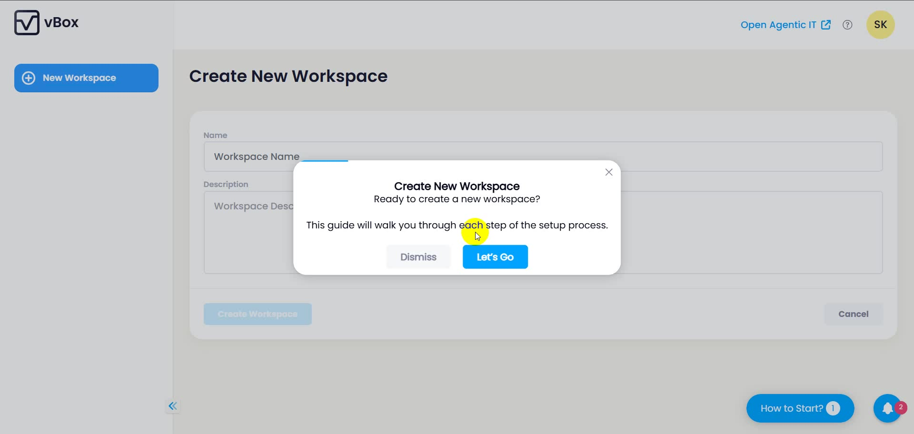

1. Enter a **Workspace Name** — choose a clear, descriptive name that helps you identify this workspace later (e.g., "Enterprise Customers" or "SMB Tier 1")

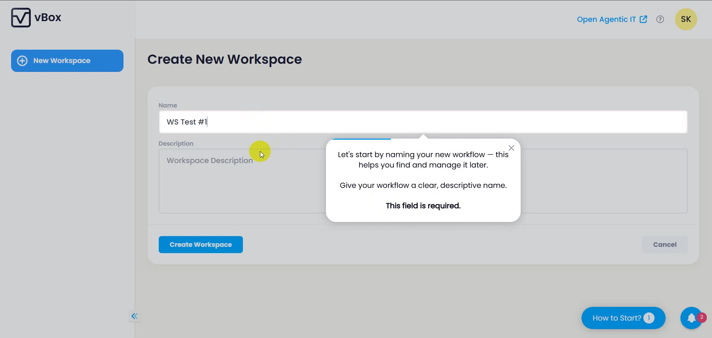

2. Optionally, enter a **Description** for the workspace (e.g., the workspace owner or purpose)
3. Click **Create Workspace**

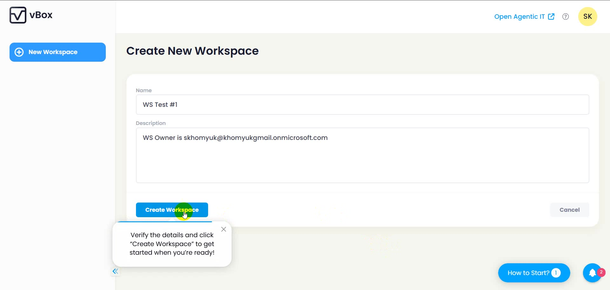

The workspace will appear in the left sidebar. The "How to Start?" checklist will update to show "Create a Workspace" as completed.

:::tip
You can create multiple workspaces at any time by clicking the "New Workspace" link in the left sidebar.
:::

---

## 3. Create an Organization

An **Organization** lives within a Workspace and connects your Azure subscriptions to vBox. Creating an organization involves a 5-step wizard.

### Step 1: Organization Info

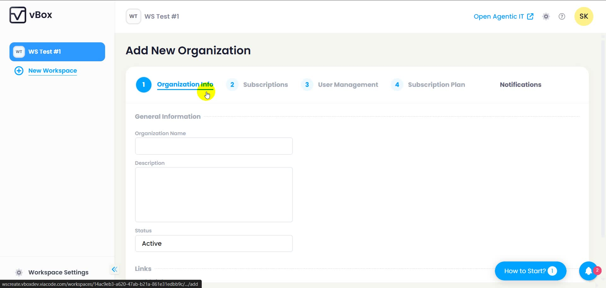

The wizard displays a progress bar at the top with five steps. Step 1 is highlighted.

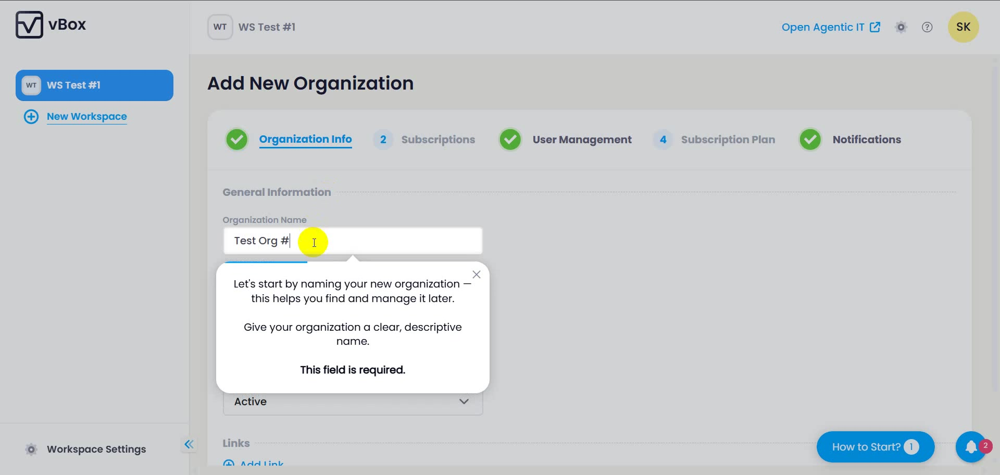

1. Enter the **Organization Name** (e.g., "Test Org #1")
2. Set the **Status** — the default is "Active"
3. Optionally, add **Links** by clicking "Add Link" for quick access to customer-specific resources
4. Click the **Subscriptions** tab to proceed to Step 2

### Step 2: Subscriptions

In this step, you authorize vBox to access your Azure resources and assign subscriptions.

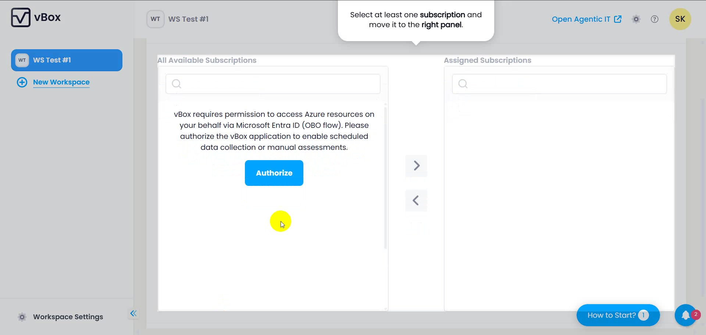

1. Click the **Authorize** button. A Microsoft permissions pop-up will appear requesting consent for the "vBox Azure Data Collection" application

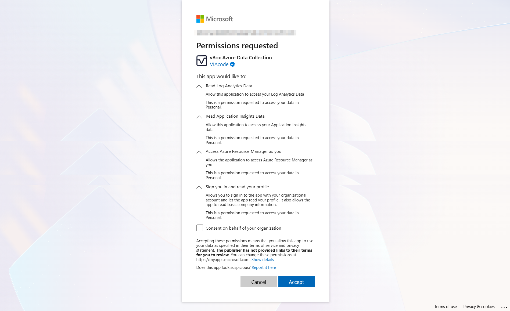

The permissions requested include:
- Sign you in and read your profile
- Read Application Insights Data
- Read Log Analytics Data
- Access Azure Resource Manager as you

2. Click **Accept** to grant these permissions

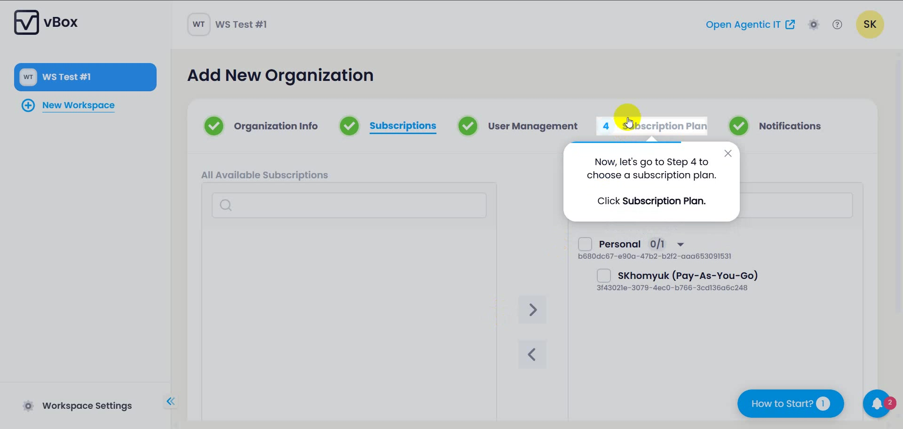

3. After authorization, your Azure subscriptions appear in the **All Available Subscriptions** panel on the left
4. Select one or more subscriptions and click the **right arrow (>)** button to move them to the **Assigned Subscriptions** panel on the right
5. Proceed to Step 3

:::note
This is the OBO (On-Behalf-Of) authorization flow. See [OBO Authentication](/administration/users-and-roles/#obo-authentication-on-behalf-of) for details.
:::

### Step 3: User Management

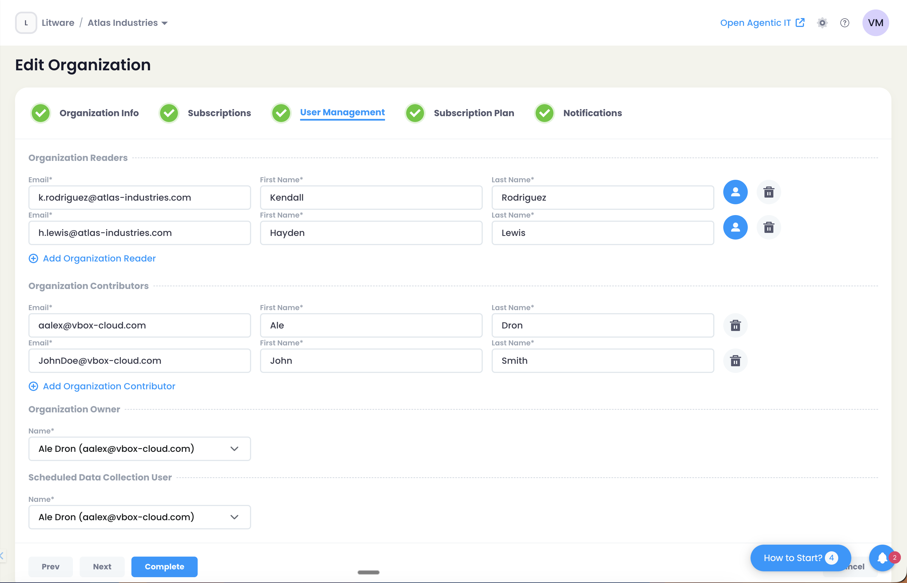

Configure user access for the organization:

- **Organization Readers** — Add users with read-only access (email, first name, last name)
- **Organization Contributors** — Add MSP users who will manage this organization
- **Organization Owner** — Select the primary account manager from the list of Contributors
- **Scheduled Data Collection User** — Select the user account for automated data collection runs

See [User Management](/administration/customers/#step-3-user-management) for detailed field descriptions.

### Step 4: Subscription Plan

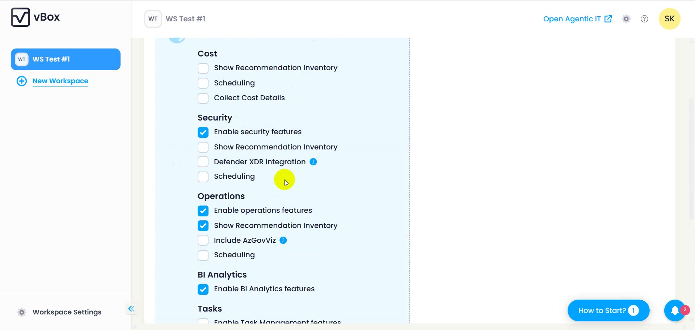

Configure which vBox features are enabled for this organization:

| Feature | Description |
|---------|-------------|
| **Cost** | Show Recommendation Inventory, Scheduling, Collect Cost Details |
| **Security** | Security features, Show Recommendation Inventory, Defender XDR integration, Scheduling |
| **Operations** | Operations features, Show Recommendation Inventory, Include AzGovViz, Scheduling |
| **BI Analytics** | Embedded Metabase dashboards on Summary pages |
| **Tasks** | Task management for tracking recommendation follow-up |

Select the features you need and configure their sub-options.

:::tip[Feature Rollout]
Start with Cost Management for quick wins, then add Security and Operations as your team ramps up. This helps customers see value quickly while allowing time for proper configuration.
:::

### Step 5: Notifications

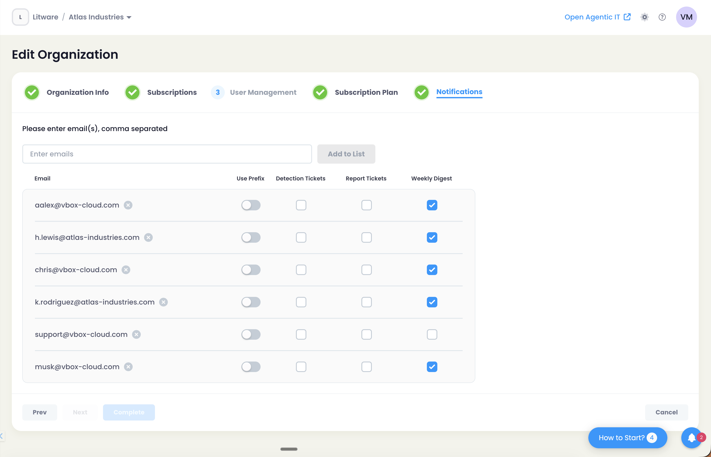

Configure email integration and notification preferences:

1. Add **Email Addresses** and optional **Email Prefixes** for categorization
2. Enable **Detection Tickets**, **Report Tickets**, or **Weekly Digest** as needed
3. Complete the organization setup by saving your configuration

The organization will now appear under your workspace in the navigation header (e.g., "WS Test #1 / Test Org #1"). The sidebar will display navigation options for Dashboard, Cost, Security, Operations, and Tasks.

---

## 4. Run Assessments

vBox supports three types of assessments: **Cost**, **Security**, and **Operations**. Each assessment collects data from your Azure environment and generates actionable recommendations.

:::note
By default, each assessment type evaluates the last **30 days** of data from your Azure environment.
:::

### Run a Cost Assessment

1. Navigate to **Cost > Assessments** in the left sidebar

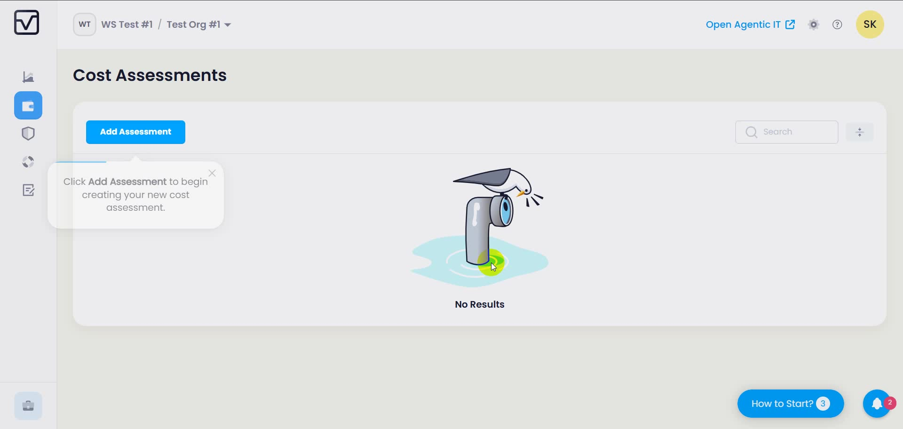

2. Click **Add Assessment**

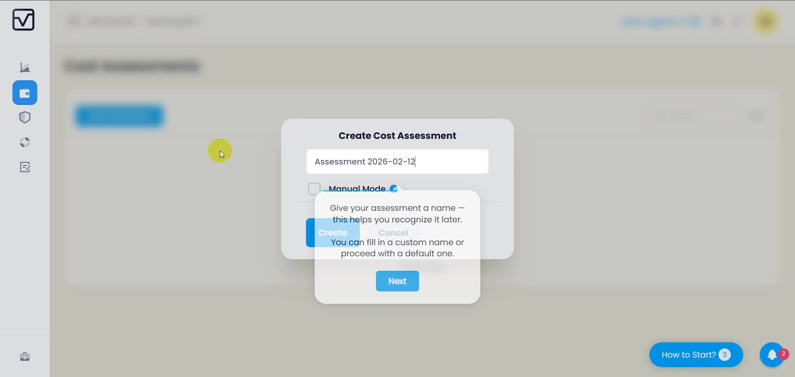

3. Enter an assessment name or keep the default (e.g., "Assessment 2026-02-12") and click **Create**

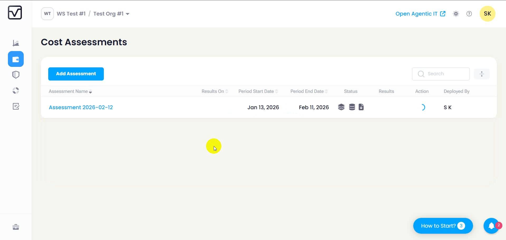

The assessment will appear in the list with a spinning indicator showing it is running. The "How to Start?" checklist will mark "Run Cost Assessment" as completed.

### Run a Security Assessment

1. Navigate to **Security > Assessments** in the left sidebar
2. Click **Add Assessment**

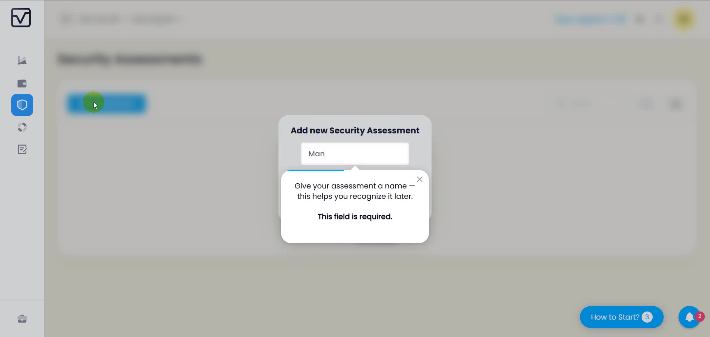

3. Enter a name for the assessment (e.g., "Manual #1") and click **Create**

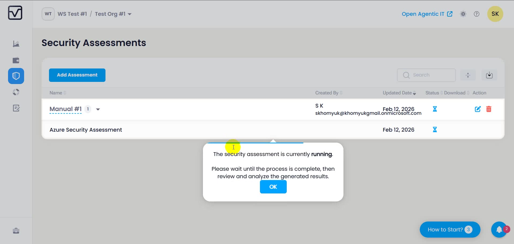

A confirmation message will appear: "The security assessment is currently running. Please wait until the process is complete, then review and analyze the generated results."

### Run an Operations Assessment

1. Navigate to **Operations > Assessments** in the left sidebar
2. Click **Add Assessment**

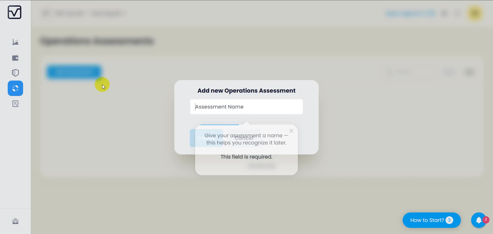

3. Enter a name for the assessment (e.g., "Manual #1") and click **Create**

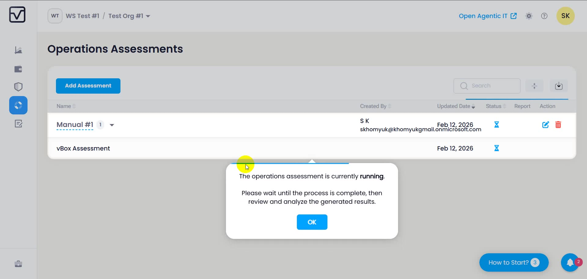

A confirmation message will appear: "The operations assessment is currently running. Please wait until the process is complete, then review and analyze the generated results."

:::tip
After running all three assessment types, the "How to Start?" checklist will show completed checkmarks for all steps.
:::

---

## 5. View Assessment Results

Once assessments are complete, you can view detailed results through the vBox interface.

### Cost Assessment Results

Click on a completed cost assessment name to open its detail page. The view shows assessment period dates, statuses, and action buttons including **Open**, **Deploy Environment**, **Resume**, **Download Results**, and **Send to ITSM**.

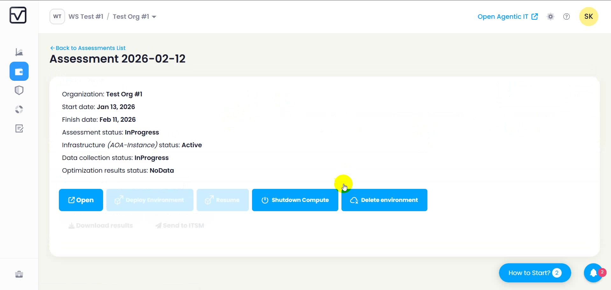

Once the assessment completes, navigate to **Cost > Recommendations** in the left sidebar to observe the generated cost optimization recommendations. Each recommendation includes potential savings, severity, and affected resources.

See [Cost Recommendations](/cost-management/recommendations/) for full details.

### Security Assessment Results

Once the security assessment completes, navigate to **Security > Recommendations** in the left sidebar to observe the generated security recommendations. Each recommendation includes Severity, Effort, User Impact, and Cost Impact.

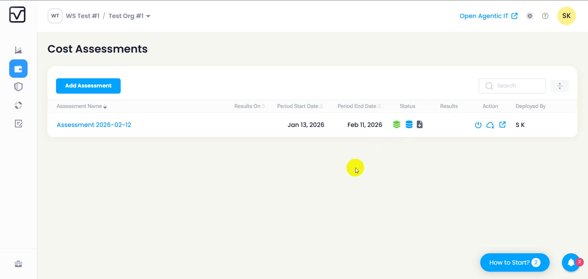

See [Security Recommendations](/security/recommendations/) for full details.

### Operations Assessment Results

Once the operations assessment completes, navigate to **Operations > Recommendations** in the left sidebar to observe the generated operations recommendations. The page shows key metrics including Observability Score, Active Recommendations, Availability, and Backup Jobs, with recommendations grouped by category.

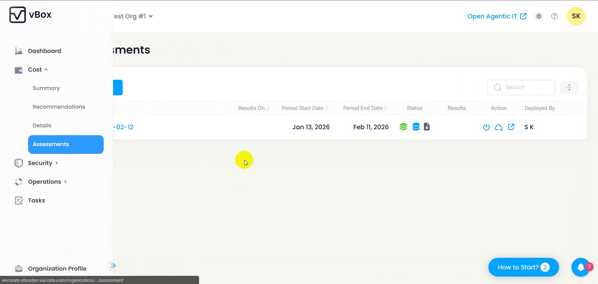

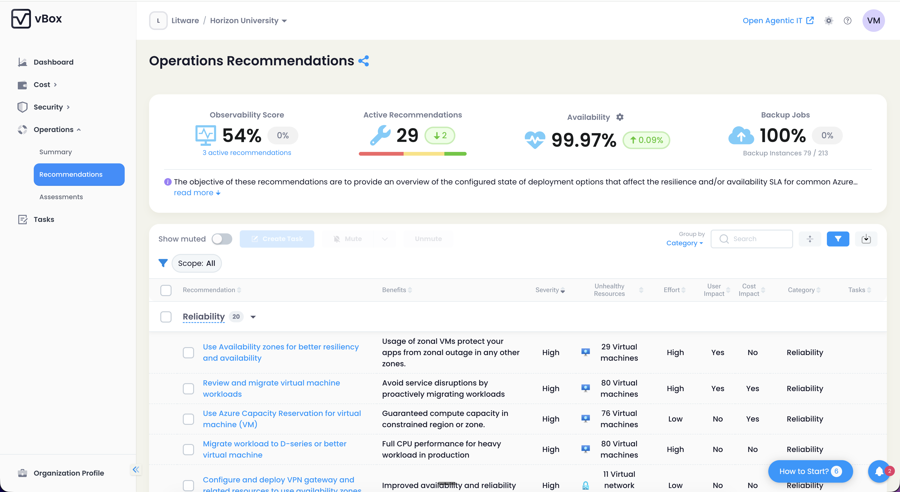

See [Operations Recommendations](/operations/recommendations/) for full details.

---

## Next Steps

- Explore [Cost Details](/cost-management/details/) for historical cost analysis with baseline comparison
- Review your [Secure Score](/security/secure-score/) to understand your security posture
- Set up [Advanced Application Consent](/integrations/app-consent/) for additional features
- Configure [MS Defender XDR Integration](/integrations/defender-xdr/) for CIS M365 benchmarks
- Learn about [Users and Roles](/administration/users-and-roles/) for permission management
