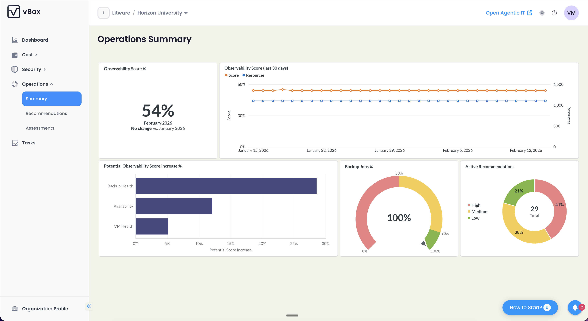

The Operations Summary page provides a high-level overview of your operational health through embedded BI dashboards powered by Metabase.

## Dashboard Charts

- **Observability Score KPI** with 30-day change
- **Observability Score trend chart** — Historical score over time
- **Potential Observability Score Increase** — Maximum improvement available
- **Backup jobs completion %** — Backup success rate
- **Active recommendations** — Count of outstanding operations recommendations

:::note
The Operations Summary page requires the [BI Analytics](/analytics/bi-analytics/) feature to be enabled.
:::
