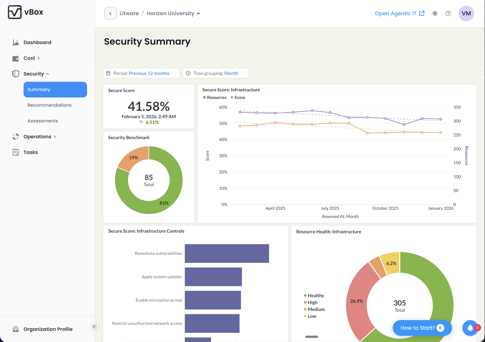

vBox Security helps organizations surface security exposures and align remediation actions with best practices. It leverages Microsoft Defender for Cloud and Microsoft Defender XDR to provide comprehensive security insights.

## Key Capabilities

- **Secure Score Tracking** — Monitor your organization's security posture with a numerical score and sub-scores across Infrastructure, Apps, Identity, Data, and Devices
- **Security Indicators** — Real-time view of Secure Score percentage, unhealthy resources count, passed controls, and active recommendations
- **Vulnerability Management** — Granular vulnerability findings from Microsoft Defender for Cloud
- **Security Recommendations** — Actionable recommendations with compliance mapping, potential score impact, and resource-level details
- **CIS M365 Benchmark** — Foundation benchmark recommendations via Defender XDR integration
- **Security Assessments** — Structured evaluation and reporting for MSP users

## Key Performance Indicators (KPIs)

The Security module provides several key performance indicators to help you understand your security posture:

| KPI | Description |
|-----|-------------|
| **Secure Score** | Overall security score percentage with 30-day trend indicator |
| **Unhealthy Resources** | Count of resources requiring attention out of total monitored resources |
| **Passed Controls** | Number of Cloud Security Benchmark controls that are currently passing |
| **Active Recommendations** | Count of recommendations that can improve your Secure Score |
| **Secure Score Breakdown** | Individual scores for Infrastructure, Apps, Identity, Data, and Devices categories |

:::tip
Monitor the Secure Score 30-day difference to track whether your security posture is improving or declining over time.
:::

## Security Pages

| Page | Route | Description |
|------|-------|-------------|
| [Summary](/security/summary/) | `/security/summary` | Security overview with embedded BI dashboards and high-level metrics |
| [Recommendations](/security/recommendations/) | `/security/recommendations` | Security recommendations with profiles, CIS controls, and compliance mapping |
| | `/security/recommendations/:code` | Individual recommendation profile page |
| | `/security/recommendations/:code/resource` | Resource-specific recommendation view |
| [Secure Score](/security/secure-score/) | `/security/secure-score` | Detailed explanation of how Secure Score works and how to improve it |
| [Vulnerabilities](/security/vulnerabilities/) | `/security/vulnerabilities` | Granular vulnerability management from Microsoft Defender for Cloud |
| [Assessments](/security/assessments/) | `/security/assessment` | Security assessment management (MSP-only) |

:::note[MSP-Only Features]
The Security Assessments page (`/security/assessment`) is available only for MSP (Managed Service Provider) users. MSP users also have access to additional features such as importing recommendations and downloading questionnaires.
:::

## Integration with Microsoft Security Services

vBox Security integrates with:

- **Microsoft Defender for Cloud** - Provides Secure Score, security recommendations, and vulnerability assessments for Azure resources
- **Microsoft Defender XDR** - Delivers CIS M365 Foundations Benchmark recommendations and cross-platform security insights

## Getting Started

1. Navigate to the [Security Summary](/security/summary/) page to view your overall security posture
2. Review [Security Recommendations](/security/recommendations/) to identify actionable improvements
3. Check your [Secure Score](/security/secure-score/) breakdown to understand which areas need attention
4. For MSP users, use [Security Assessments](/security/assessments/) to create structured security evaluations
