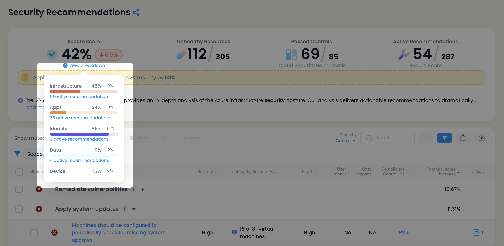
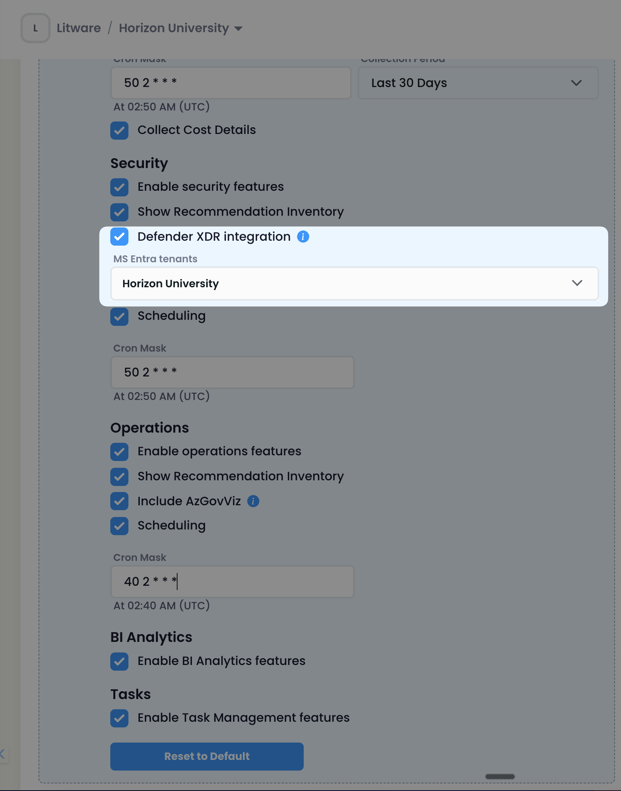
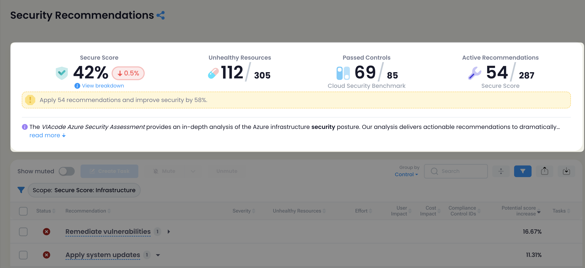
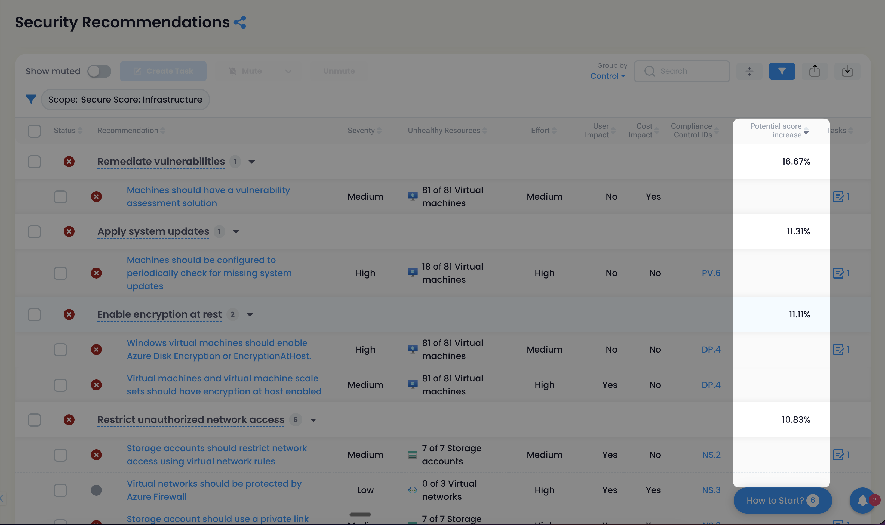

## What is Secure Score?

Secure Score KPI is a measurement of an organization's security posture within the Microsoft ecosystem. It provides a numerical score and actionable recommendations to help proactively improve your security defenses and reduce risk. A higher score indicates a stronger security posture and better protection against threats.

**Secure Score** consists of the following sub-scores:

1. Infrastructure
2. Apps
3. Identity
4. Data
5. Devices

## How Secure Scores Are Calculated

### Infrastructure

**"Secure Score: Infrastructure" relies on Microsoft Defender for Cloud internal calculation and uses it as a data source.**

It is calculated at the "Security control" level. Each individual security control contributes toward the secure score, and each resource affected by a recommendation within the control contributes toward the control's current score. The secure score does not include resources found in preview recommendations.

For example, if the maximum score of a control is 6 and is divided by 78 (the sum of healthy and unhealthy resources), then 6 / 78 = 0.0769. Multiplying that by the number of healthy resources (4) results in the current score: 0.0769 * 4 = **0.31**.

### Apps, Identity, Data, Devices

**These secure score values are obtained from the Microsoft Defender XDR product.**

Each recommendation is worth a certain number of points, and most are scored in a binary fashion. If you implement the recommended action, such as creating a new policy or turning on a specific setting, you get 100% of the points. For other recommended actions, points are given as a percentage of the total configuration.

For example, a recommended action states you get 10 points by protecting all your users with multifactor authentication. You only have 50 of 100 total users protected, so you'd get a partial score of five points (50 protected / 100 total * 10 max pts = **5 pts**).

### Total Secure Score

The total "Secure Score" is an average value between the Infrastructure Score and the combined score for Apps, Identity, Data, and Devices.

> **Secure Score = (Infrastructure + Defender XDR Scores) / 2**

## How to Get It

**Secure Score: Infrastructure** is included by default in the Secure Score and will be calculated once the "Security Features" setting is enabled for a "Customer".

**Apps, Identity, Data, Devices** secure scores will be included in the Secure Score after enabling the "Defender XDR Integration" setting for a "Customer".

For "Defender XDR Integration" setup instructions, see [MS Defender XDR Integration](/integrations/defender-xdr/).

## Where to See It

### Security Summary

There is a Secure Score widget on the Security Summary page that displays the current Secure Score value, the change over the last 30 days, and a sub-score breakdown.

### Security Recommendations

The KPI Panel contains the current Secure Score value with a sub-score breakdown.

You can filter the list of recommendations by selecting a "Secure Score: X" scope, where X is one of the sub-scores, to see only recommendations that affect that specific score.

The **Potential Score Increase** column shows how much it will impact the score once completed.

