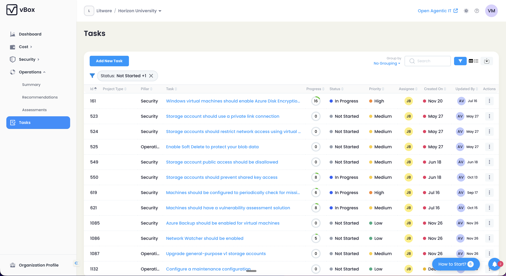
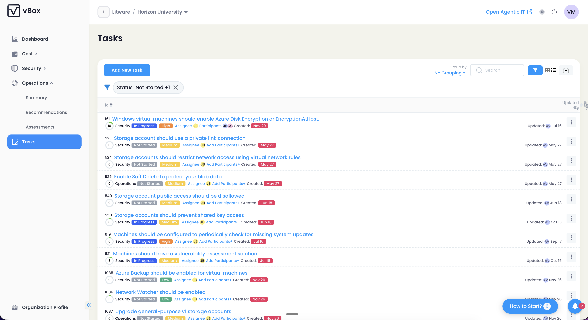
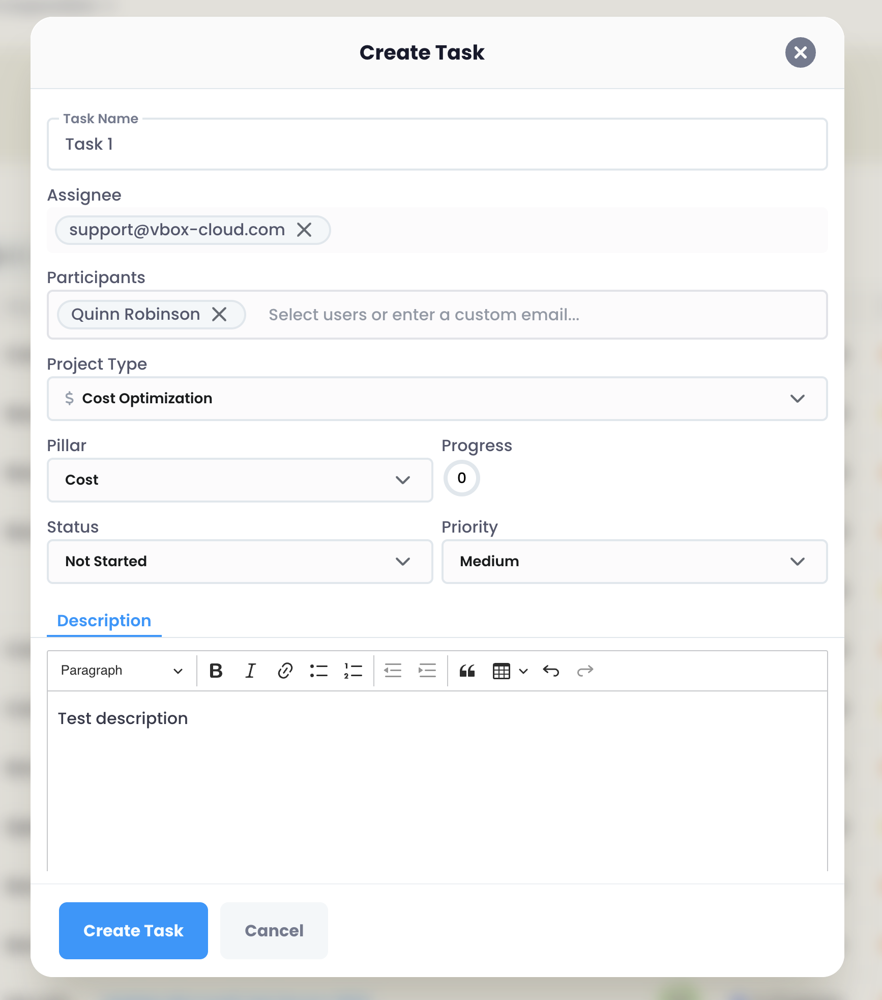

The Tasks module in vBox provides comprehensive task management and tracking capabilities for cloud improvement work items that arise from cost, security, and operations recommendations. Create, assign, track, and resolve tasks systematically to ensure accountability and progress on your cloud optimization initiatives.

## Routes

The Tasks module is accessible through the following routes:

- **`/tasks`** — Task list page with filtering, sorting, and search capabilities
- **`/tasks/:taskId`** — Individual task profile page with detailed information
- **`/tasks/new`** — Create new task form

:::tip
Use tasks to create accountability for recommendation follow-up. Convert high-priority recommendations into tasks and assign them to team members for systematic improvement.
:::

## Task List Page

The task list page provides a comprehensive view of all tasks with multiple viewing options, filtering capabilities, and management actions.

### View Modes

The task list supports two view modes that can be toggled:

- **Table View** — Structured tabular layout with sortable columns
- **List View** — Card-based layout optimized for detailed task information

Your preferred view mode is automatically saved in localStorage and persists across sessions.

### Table Columns

When using Table View, the following columns are displayed:

| Column | Width | Description |
|--------|-------|-------------|
| **Id** | Auto | Unique task identifier |
| **Pillar** | 10% | Task category (Empty, Cost, Security, Operations) |
| **Task** | 45% | Task name and description |
| **Progress** | Auto | Circular progress indicator showing completion percentage |
| **Status** | Auto | Current task status with badge dropdown for quick updates |
| **Priority** | Auto | Task priority level with badge dropdown for quick updates |
| **Assignee** | Auto | Assigned user with avatar display |
| **Created On** | Auto | Creation date with age badge indicator |
| **Updated By** | Auto | Last user to update the task with avatar and date |
| **Actions** | Auto | Three-dot menu with available actions |

### Filters

The task list supports comprehensive filtering to help you find specific tasks:

#### Pillar Filter
Filter tasks by their associated pillar:
- **Empty** — Tasks without a specific pillar assignment
- **Cost** — Cost optimization tasks
- **Security** — Security improvement tasks
- **Operations** — Operational tasks

#### Status Filter
Filter tasks by their current status. Default selection includes:
- **Not Started** — Tasks that haven't been initiated
- **In Progress** — Tasks currently being worked on

Additional status options:
- **Completed** — Finished tasks
- **Canceled** — Cancelled tasks

#### Priority Filter
Filter tasks by priority level:
- **Low** — Low priority tasks
- **Medium** — Medium priority tasks
- **High** — High priority tasks
- **Critical** — Critical priority tasks

#### Assignee Filter
Filter tasks by assigned user using an autocomplete search field. Type to search for users by name or email.

### Global Search

A global search field allows you to search across all task fields simultaneously, including task name, description, assignee, and other metadata.

### Sorting

Tasks are sorted by default in ascending order by **ID**. You can modify the sort order by clicking on column headers in Table View.

:::note
Grouping options are not currently available in the task list view.
:::

## Task Statuses

Tasks can be in one of the following statuses:

| Status | Badge Color | Description |
|--------|-------------|-------------|
| **Not Started** | Gray | Task has been created but work has not begun |
| **In Progress** | Blue | Task is currently being actively worked on |
| **Completed** | Green | Task has been finished successfully |
| **Canceled** | Orange | Task has been cancelled and will not be completed |

Status can be changed inline using the status badge dropdown in the task list, or from the task profile page.

## Task Priorities

Tasks are assigned priority levels to help prioritize work:

| Priority | Badge Color | Description |
|----------|-------------|-------------|
| **Low** | Green | Low priority, can be addressed when convenient |
| **Medium** | Yellow | Medium priority, standard importance |
| **High** | Orange | High priority, should be addressed soon |
| **Critical** | Red | Critical priority, requires immediate attention |

Priority can be changed inline using the priority badge dropdown in the task list, or from the task profile page.

## Task Pillars

Tasks are categorized into pillars that align with different aspects of cloud optimization:

| Pillar | Description |
|--------|-------------|
| **Empty** | Tasks without a specific pillar assignment |
| **Cost** | Tasks related to cost optimization and savings |
| **Security** | Tasks related to security improvements and compliance |
| **Operations** | Tasks related to operational efficiency and reliability |

## Task Age Indicators

Tasks display age badges based on how long they have been active (not completed or canceled):

| Age Range | Badge | Description |
|-----------|-------|-------------|
| **0-30 days** | None | New tasks (no badge displayed) |
| **31-60 days** | Yellow | Aging tasks that may need attention |
| **61+ days** | Red | Stale tasks that require immediate review |

:::tip
Age badges only appear for active tasks (Not Started or In Progress status). Completed and Canceled tasks do not display age indicators.
:::

## Actions

The Tasks module provides a comprehensive set of actions for managing tasks:

### Inline Actions

These actions are available directly from the task list:

- **Change Status** — Quick status update via dropdown menu
- **Change Priority** — Quick priority update via dropdown menu
- **Manage Assignee** — Assign or reassign tasks to team members
- **Manage Participants** — Add or remove participants (available in List View)

### Action Menu (Three-Dot Menu)

Access additional actions through the three-dot menu in the Actions column:

#### Resolve with AI

Conditionally available when:
- AI feature flag (`FEATURE_AI_TASK_REMEDIATION`) is enabled
- Task has a recommendation source
- Task status is active (Not Started or In Progress)

This action leverages AI to automatically resolve tasks based on their associated recommendations.

#### Search in Jira

Opens the associated Jira ticket in a new tab. Only available if the task has a Jira URL configured.

#### Copy Link

Copies a direct link to the task profile page to your clipboard for easy sharing.

#### Delete

Permanently deletes the task after confirmation. This action cannot be undone.

:::warning
Deleting a task is permanent and cannot be reversed. Ensure you have a backup or export of important task data before deletion.
:::

### Page-Level Actions

#### Create Task

Click the **"Add New Task"** button to create a new task. This opens the task creation form.

#### Export to Excel

Export all filtered tasks to an Excel file with the following columns:

- Id
- Pillar
- Task
- Progress%
- Status
- Priority
- Assignee
- Created By/Date
- Updated By/Date
- To-Do Items #
- To-Do Items Completed

## Task Form Fields

When creating or editing a task, the following fields are available:

| Field | Required | Description |
|-------|----------|-------------|
| **Task Name** | Yes | Descriptive name for the task |
| **Assignee** | No | User assigned to complete the task |
| **Participants** | No | Additional team members involved in the task |
| **Pillar** | No | Category classification (Empty, Cost, Security, Operations) |
| **Status** | No | Current status (defaults to Not Started) |
| **Priority** | No | Priority level (Low, Medium, High, Critical) |
| **Description** | No | Rich text description using CKEditor with formatting options |
| **To-Do List** | No | Checklist items for recommendation-based tasks |

## Task-Recommendation Relationship

Tasks can be created from two sources:

### Recommendation-Based Tasks

Tasks created from recommendations (`UserTaskFromRecommendationSource`) automatically:
- Link to the source recommendation
- Display the recommendation link in the task form
- Auto-track progress based on recommendation status
- Calculate progress using the formula: `((total - active) / total) * 100`

### Manually Created Tasks

Tasks created manually (`UserTaskUserCreatedSource`) are independent work items not tied to specific recommendations. These tasks require manual progress tracking.

:::note
The progress calculation for recommendation-based tasks automatically updates as the underlying recommendation status changes, providing real-time visibility into remediation progress.
:::

## Feature Flags

The Tasks module availability and functionality are controlled by feature flags:

### CustomerComponent.TASKS

Controls the overall availability of the Tasks module. When disabled:
- Tasks module is not accessible
- An upsell banner is displayed to users

### FEATURE_AI_TASK_REMEDIATION

Controls the availability of AI-powered task resolution:
- When enabled: "Resolve with AI" action appears in the action menu for eligible tasks
- When disabled: AI resolution option is hidden

## Upsell Banner Features

When the Tasks module is unavailable, the upsell banner highlights the following capabilities:

- ✅ **Create & edit tasks** — Organize and manage your cloud improvement work items
- ✅ **Assign tasks** — Delegate work to team members with clear ownership
- ✅ **Update status** — Track task progress through completion
- ✅ **Track progress automatically** — Real-time progress updates for recommendation-based tasks
- ✅ **Comment & collaborate** — Team communication and collaboration on tasks
- ✅ **Receive notifications** — Stay informed about task updates and assignments
- ✅ **Search & filter tasks** — Quickly find tasks using powerful search and filter options

